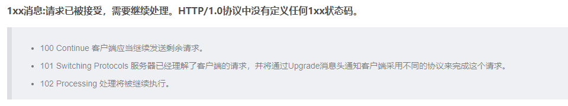
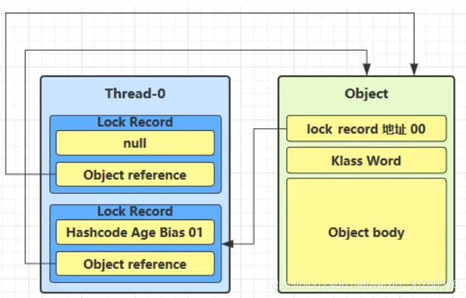
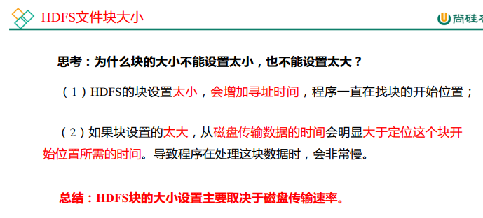
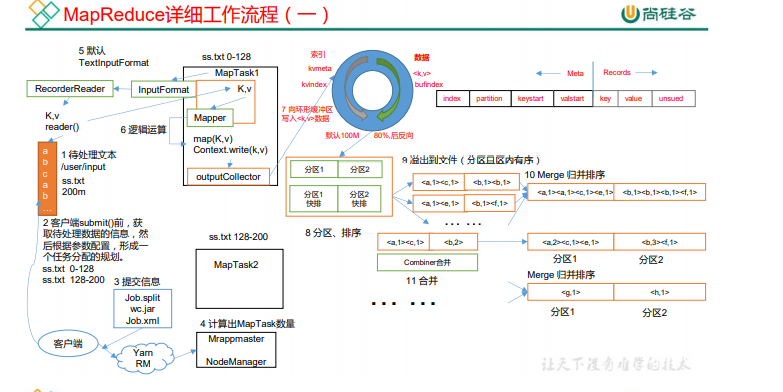
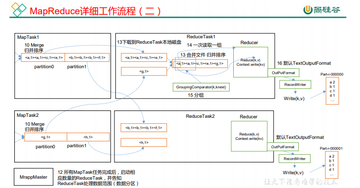

# 八股文

### 1.Java String

- **String、StringBuffer、StringBuilder的区别**

  String是不可变类，任何对String的改变都会引发新的String对象产生。

  StringBuffer是可变类，其内部改变不会有新的对象产生。

  StringBuilder则是线程不安全的，在单线程下性能比StringBuffer好，区别在于StringBuffer的大多数方法都加了synchronized修饰。

- **String 的内部实现**

  **JDK9**之前内部通过字符数组

  ```java
   private final char value[];
  ```

  **JDK9**开始改用

  ```java
  private final byte[] value;
  ```
  
  **改用原因：**
  
  String类的当前实现将字符存储在char数组中，每个字符使用两个字节(16位)。从许多不同的应用程序收集的数据表明，字符串是堆使用的主要组成部分，而且，大多数字符串对象只包含拉丁字符。这些字符只需要一个字节的存储空间，因此这些字符串对象的内部char数组中有一半的空间将不会使用。

  我们建议改变字符串的内部表示clasš从utf - 16字符数组到字节数组+一个encoding-flag字段。新的String类将根据字符串的内容存储编码为ISO-8859-1/Latin-1(每个字符一个字节)或UTF-16(每个字符两个字节)的字符。编码标志将指示使用哪种编码。

  **在编译期**，使用字符串字面量定义的String，会在常量池中存储，最大长度是65534字节。
  
  ```java
  CONSTANT_Utf8_info {
      u1 tag;
      u2 length;
      u1 bytes[length];
  }
  ```
  
  可以看到length类型为u2，u2是无符号的16位整数，最大长度为65535.但受javac额外限制，当长度刚好是65535时会编译失败。因此最大只能65534个字节，eclipse使用自己的编译器，不用javac，因此最大为65535
  
  **在运行期的String**，length类型为int，那么String允许的最大长度就是Integer.MAX_VALUE，优于java中的字符是以16位存储的，因此大概需要4GB的内存才能存储最大长度的字符串。

- **字符串常量池的位置**

  Java 6及以前，字符串常量池存放在永久代

  Java 7中 oracle的工程师对字符串池的逻辑做了很大的改变，即将字符串常量池的位置调整到Java堆内

  >所有的字符串都保存在堆（Heap）中，和其他普通对象一样，这样可以让你在进行调优应用时仅需要调整堆大小就可以了。
  >
  >字符串常量池概念原本使用得比较多，但是这个改动使得我们有足够的理由让我们重新考虑在Java 7中使用string.intern（）。

  Java8元空间，字符串常量在堆

  ##### 为什么StringTable从永久代调整到堆中

  在JDK 7中，interned字符串不再在Java堆的永久生成中分配，而是在Java堆的主要部分(称为年轻代和年老代)中分配，与应用程序创建的其他对象一起分配。此更改将导致驻留在主Java堆中的数据更多，驻留在永久生成中的数据更少，因此可能需要调整堆大小。由于这一变化，大多数应用程序在堆使用方面只会看到相对较小的差异，但加载许多类或大量使用字符串的较大应用程序会出现这种差异。intern()方法会看到更显著的差异。

  - 永久代的默认比较小
  - 永久代垃圾回收频率低

- **字符串拼接操作**

  - 常量与常量的拼接结果在常量池，原理是编译期优化
  - 常量池中不会存在相同内容的变量
  - 只要其中有一个是变量，结果就在堆中。变量拼接的原理是StringBuilder
  - 如果拼接的结果调用intern()方法，则主动将常量池中还没有的字符串对象放入池中，并返回此对象地址

  ```java
      public static void test1() {
          String s1 = "a" + "b" + "c";  // 得到 abc的常量池
          String s2 = "abc"; // abc存放在常量池，直接将常量池的地址返回
          /**
           * 最终java编译成.class，再执行.class
           */
          System.out.println(s1 == s2); // true，因为存放在字符串常量池
          System.out.println(s1.equals(s2)); // true
      }
  
  	public static void test2() {
          String s1 = "javaEE";
          String s2 = "hadoop";
          String s3 = "javaEEhadoop";
          String s4 = "javaEE" + "hadoop";    
          String s5 = s1 + "hadoop";
          String s6 = "javaEE" + s2;
          String s7 = s1 + s2;
  
          System.out.println(s3 == s4); // true
          System.out.println(s3 == s5); // false
          System.out.println(s3 == s6); // false
          System.out.println(s3 == s7); // false
          System.out.println(s5 == s6); // false
          System.out.println(s5 == s7); // false
          System.out.println(s6 == s7); // false
  
          String s8 = s6.intern();
          System.out.println(s3 == s8); // true
      }
  ```

  从上述的结果我们可以知道：

  如果拼接符号的前后出现了变量，则相当于在堆空间中new String()，具体的内容为拼接的结果

  而调用intern方法，则会判断字符串常量池中是否存在JavaEEhadoop值，如果存在则返回常量池中的值，否者就在常量池中创建

  ### 底层原理

  拼接操作的底层其实使用了StringBuilder

  

  s1 + s2的执行细节

  - StringBuilder s = new StringBuilder();
  - s.append(s1);
  - s.append(s2);
  - s.toString();  -> 类似于new String("ab");

  在JDK5之后，使用的是StringBuilder，在JDK5之前使用的是StringBuffer

  | String                                                       | StringBuffer                                                 | StringBuilder    |
  | ------------------------------------------------------------ | ------------------------------------------------------------ | ---------------- |
  | String的值是不可变的，这就导致每次对String的操作都会生成新的String对象，不仅效率低下，而且浪费大量优先的内存空间 | StringBuffer是可变类，和线程安全的字符串操作类，任何对它指向的字符串的操作都不会产生新的对象。每个StringBuffer对象都有一定的缓冲区容量，当字符串大小没有超过容量时，不会分配新的容量，当字符串大小超过容量时，会自动增加容量 | 可变类，速度更快 |
  | 不可变                                                       | 可变                                                         | 可变             |
  |                                                              | 线程安全                                                     | 线程不安全       |
  |                                                              | 多线程操作字符串                                             | 单线程操作字符串 |

  注意，我们左右两边如果是变量的话，就是需要new StringBuilder进行拼接，但是如果使用的是final修饰，则是从常量池中获取。所以说拼接符号左右两边都是字符串常量或常量引用 则仍然使用编译器优化。也就是说被final修饰的变量，将会变成常量，类和方法将不能被继承、

  - 在开发中，能够使用final的时候，建议使用上

  ##### 拼接操作和append性能对比

  结论：

  - 通过StringBuilder的append()方式添加字符串的效率，要远远高于String的字符串拼接方法

  好处

  - StringBuilder的append的方式，自始至终只创建一个StringBuilder的对象
  - 对于字符串拼接的方式，还需要创建很多StringBuilder对象和 调用toString时候创建的String对象
  - 内存中由于创建了较多的StringBuilder和String对象，内存占用过大，如果进行GC那么将会耗费更多的时间

  改进的空间

  - 我们使用的是StringBuilder的空参构造器，默认的字符串容量是16，然后将原来的字符串拷贝到新的字符串中， 我们也可以默认初始化更大的长度，减少扩容的次数
  - 因此在实际开发中，我们能够确定，前前后后需要添加的字符串不高于某个限定值，那么建议使用构造器创建一个阈值的长度

- **面试题**

  ##### new String("ab")会创建几个对象

  这里面就是两个对象

  - 一个对象是：new关键字在堆空间中创建
  - 另一个对象：字符串常量池中的对象

  ##### new String("a") + new String("b") 会创建几个对象码文件为

  我们创建了6个对象

  - 对象1：new StringBuilder()
  - 对象2：new String("a")
  - 对象3：常量池的 a
  - 对象4：new String("b")
  - 对象5：常量池的 b
  - 对象6：toString中会创建一个 new String("ab")
    - 调用toString方法，不会在常量池中生成ab

- **intern**

  总结string的intern（）的使用：

  JDK1.6中，将这个字符串对象尝试放入串池。

  - 如果串池中有，则并不会放入。返回已有的串池中的对象的地址
  - 如果没有，会把此**对象复制一份**，放入串池，并返回串池中的对象地址

  JDK1.7起，将这个字符串对象尝试放入串池。

  - 如果串池中有，则并不会放入。返回已有的串池中的对象的地址
  - 如果没有，则会把**对象的引用地址**复制一份，放入串池，并返回串池中的引用地址

### 2.java Map相关

- **HashMap底层原理**

  

  - **静态常量**

    ```java
    /**
     * 默认的初始容量，必须是二的次方，后面计算index时用的是与运算而不是取模，与运算速度快，但要求长度为二的次方
     */
     static final int DEFAULT_INITIAL_CAPACITY = 1 << 4; // aka 16
    /**
     * 最大容量，当通过构造函数隐式指定了一个大于MAXIMUM_CAPACITY的时候使用
     */
    static final int MAXIMUM_CAPACITY = 1 << 30;
    /**
     * 加载因子，当构造函数没有指定加载因子的时候的默认值的时候使用
     */
    static final float DEFAULT_LOAD_FACTOR = 0.75f;
    
    /**
     * TREEIFY_THRESHOLD为当一个bin从list转化为tree的阈值，当一个bin中元素的总元素最低超过这个值的时候，bin才被转化为tree；
     * 为了满足转化为简单bin时的要求，TREEIFY_THRESHOLD必须比2大而且比8要小
     */
    static final int TREEIFY_THRESHOLD = 8;
    /**
     * bin反tree化时的最大值，应该比TREEIFY_THRESHOLD要小，
     * 为了在移除元素的时候能检测到移除动作，UNTREEIFY_THRESHOLD必须至少为6
     */
    static final int UNTREEIFY_THRESHOLD = 6;
    
    /**
     * 树化的另外一个阈值，table的长度(注意不是bin的长度)的最小得为64。为了避免扩容和树型结构化阈值之间的冲突，MIN_TREEIFY_CAPACITY 应该最小是 4 * TREEIFY_THRESHOLD
     */
    static final int MIN_TREEIFY_CAPACITY = 64;
    ```


  - **成员变量**

    ```java
    /**
     * table，第一次被使用的时候才进行加载
     */
    transient Node<K,V>[] table;
    /**
     * 键值对缓存，它们的映射关系集合保存在entrySet中。即使Key在外部修改导致hashCode变化，缓存中还可以找到映射关系
     */
    transient Set<Map.Entry<K,V>> entrySet;
    
    /**
     * table中 key-value 元素的个数
     */
    transient int size;
    
    /**
     * HashMap在结构上被修改的次数，结构上被修改是指那些改变HashMap中映射的数量或者以其他方式修改其内部结构的次数（例如，rehash）。
     * 此字段用于使HashMap集合视图上的迭代器快速失败。
     */
    transient int modCount;
    
    /**
     * 下一次resize扩容阈值，当前table中的元素超过此值时，触发扩容
     * threshold = capacity * load factor
     */
    int threshold;
    
    /**
     * 负载因子
     * @serial
     */
    final float loadFactor;
    ```

  - 构造方法

    ```java
    public HashMap(int initialCapacity, float loadFactor) {
        if (initialCapacity < 0)
            throw new IllegalArgumentException("Illegal initial capacity: " +
                    initialCapacity);
        if (initialCapacity > MAXIMUM_CAPACITY)
            initialCapacity = MAXIMUM_CAPACITY;
        if (loadFactor <= 0 || Float.isNaN(loadFactor))
            throw new IllegalArgumentException("Illegal load factor: " +
                    loadFactor);
        
        this.loadFactor = loadFactor;
        this.threshold = tableSizeFor(initialCapacity);
    }
    
    /**
     * 
     * 1.返回一个大于等于当前值cap的一个的数字，并且这个数字一定是2的次方数
     * 假如cap为10，那么n= 9 = 0b1001
     * 0b1001 | 0b0100 = 0b1101
     * 0b1101 | 0b0011 = 0b1111
     * 0b1111 | 0b0011 = 0b1111
     * ......
     * .....
     * n = 0b1111 = 15
     * 
     * 2.这里的cap必须要减1，如果不减，并且如果传入的cap为16，那么算出来的值为32，防止二次扩容
     * 
     * 3.这个方法就是为了把最高位1的后面都变为1
     * 0001 1101 1100 -> 0001 1111 1111 -> +1 -> 0010 1111 1111
     */
    static final int tableSizeFor(int cap) {
        int n = cap - 1;
        n |= n >>> 1;
        n |= n >>> 2;
        n |= n >>> 4;
        n |= n >>> 8;
        n |= n >>> 16;
        return (n < 0) ? 1 : (n >= MAXIMUM_CAPACITY) ? MAXIMUM_CAPACITY : n + 1;
    }
    ```

  - put操作

    ```java
     /**
      * 返回先前key对应的value值（如果value为null，也返回null），如果先前不存在这个key，那么返回的就是null；
      */
      public V put(K key, V value) {
         return putVal(hash(key), key, value, false, true);
       }
        /*
        * 在往haspmap中插入一个元素的时候，由元素的hashcode经过一个扰动函数之后再与table的长度进行与运算才找到插入位置，下面的这个hash()方法就是所谓的扰动函数
         * 作用：让key的hashCode值的高16位参与运算,hash()方法返回的值的低十六位是有hashCode的高低16位共同的特征的
         * 举例
         * hashCode = 0b 0010 0101 1010 1100  0011 1111 0010 1110
         * 
         *     0b 0010 0101 1010 1100  0011 1111 0010 1110  ^ 
         *     0b 0000 0000 0000 0000  0010 0101 1010 1100 
         *     0b 0010 0101 1010 1100  0001 1010 1000 0010
         */
        static final int hash(Object key) {
            int h;
            return (key == null) ? 0 : (h = key.hashCode()) ^ (h >>> 16);
        }
    
    
    final V putVal(int hash, K key, V value, boolean onlyIfAbsent,
                       boolean evict) {
            // tab表示当前hashmap的table
            // p表示table的元素
            // n表示散列表的长度
            // i表示路由寻址结果
            Node<K,V>[] tab; Node<K,V> p; int n, i;
            
            // 延迟初始化逻辑，第一次调用putval()方法的时候才进行初始化hashmap中最耗内存的talbe
            if ((tab = table) == null || (n = tab.length) == 0)
                n = (tab = resize()).length;
            
            // 1.最简单的一种情况，寻找到的桶位，刚好是null，这个时候直接构建Node节点放进去就行了
            if ((p = tab[i = (n - 1) & hash]) == null)
                tab[i] = newNode(hash, key, value, null);
            
             
            else {
                // e，如果key不为null，并且找到了当前要插入的key一致的node元素，就保存在e中
                // k表示一个临时的key
                Node<K,V> e; K k;
                
                // 2.表示该桶位中的第一个元素与你当前插入的node元素的key一致，表示后序要进行替换操作
                if (p.hash == hash &&
                        ((k = p.key) == key || (key != null && key.equals(k))))
                    e = p;
                
                // 3.表示当前桶位已经树化了
                else if (p instanceof TreeNode)
                    e = ((TreeNode<K,V>)p).putTreeVal(this, tab, hash, key, value);
                
                // 4.当前捅位是一个链表
                else {
                    for (int binCount = 0; ; ++binCount) {
                        // 4.1 迭代到最后一个元素了也没有找到要插入的key一致的node
                        if ((e = p.next) == null) {
                            p.next = newNode(hash, key, value, null);
                            if (binCount >= TREEIFY_THRESHOLD - 1) // -1 for 1st
                                treeifyBin(tab, hash);
                            break;
                        }
    
                        // 4.1 找到了与要插入的key一致的node元素
                        if (e.hash == hash &&
                                ((k = e.key) == key || (key != null && key.equals(k))))
                            break;
                        p = e;
                    }
                }
                // 如果找到了与要插入的key一致的node元素，那么进行替换
                if (e != null) { // existing mapping for key
                    V oldValue = e.value;
                    if (!onlyIfAbsent || oldValue == null)
                        e.value = value;
                    afterNodeAccess(e);
                    return oldValue;
                }
            }
            // nodeCount表示散列表table结构的修改次数，替换Node元素的value不算
            ++modCount;
            if (++size > threshold)
                resize();
            afterNodeInsertion(evict);
            return null;
        }
    ```

- **resize**

  当在table长度位16中的元素移到table长度位32的table中的时候；我们可以知道，原来在15这个槽位的元素的hash()值的后四位一定是1111（因为跟1111即table长度-1  进行与运算得到了1111）。所以所以当table长度变为32的时候，原来在15这个槽位的元素要么还在15这个槽位，要么在31这个操作（因为原来15这个槽位的元素后五位一定是11111或者01111，跟 11111即table新长度-1 进行与运算一定得到 01111或者11111）

  

  ```java
  /**
   * 对table进行初始化或者扩容。
   * 如果table为null，则对table进行初始化
   * 如果对table扩容，因为每次扩容都是翻倍，与原来计算（n-1）&hash的结果相比，节点要么就在原来的位置，要么就被分配到“原位置+旧容量”这个位置。
   */
      final Node<K,V>[] resize() {
          Node<K,V>[] oldTab = table;
          // oldCap表示扩容之前table数组的长度
          int oldCap = (oldTab == null) ? 0 : oldTab.length;
          // oldThr表示本次扩容之前的阈值，触发本次扩容操作的阈值
          int oldThr = threshold;
          // newCap：表示扩容之后table数组的大小； newThr表示扩容之后，下次出发扩容的条件
          int newCap, newThr = 0;
          //===================给newCap和newThr赋值start=============================
          // oldCap大于零，说明之前已经初始化过了（hashmap中的散列表不是null），要进行正常的扩容操作
          if (oldCap > 0) {
              // 已经最大值了，不再扩容了
              if (oldCap >= MAXIMUM_CAPACITY) {
                  threshold = Integer.MAX_VALUE;
                  return oldTab;
              }
              // （1）进行翻倍扩容(假如旧的oldCap为8， < DEFAULT_INITIAL_CAPACITY，那么此条件不成立newThr将不会赋值)
              else if ((newCap = oldCap << 1) < MAXIMUM_CAPACITY &&
                      oldCap >= DEFAULT_INITIAL_CAPACITY)
                  newThr = oldThr << 1; // double threshold
          }
          // （2）
          // oldCap == 0（说明hashmap中的散列表是null）且oldThr > 0 ；下面几种情况都会出现oldCap == 0,oldThr > 0
          // 1.public HashMap(int initialCapacity);
          // 2.public HashMap(Map<? extends K, ? extends V> m);并且这个map有数据
          // 3.public HashMap(int initialCapacity, float loadFactor);
          else if (oldThr > 0) // initial capacity was placed in threshold
              newCap = oldThr;
          // oldCap == 0, oldThr == 0
          // public HashMap();
          else {               // zero initial threshold signifies using defaults
              newCap = DEFAULT_INITIAL_CAPACITY;
              newThr = (int)(DEFAULT_LOAD_FACTOR * DEFAULT_INITIAL_CAPACITY);
          }
  
          // 对应上面（1）不成立或者（2）成立的情况
          if (newThr == 0) {
              float ft = (float)newCap * loadFactor;
              newThr = (newCap < MAXIMUM_CAPACITY && ft < (float)MAXIMUM_CAPACITY ?
                      (int)ft : Integer.MAX_VALUE);
          }
          //===================给newCap和newThr赋值end=============================
          threshold = newThr;
          @SuppressWarnings({"rawtypes","unchecked"})
          Node<K,V>[] newTab = (Node<K,V>[])new Node[newCap];
          table = newTab;
          if (oldTab != null) {
              for (int j = 0; j < oldCap; ++j) {
                  Node<K,V> e;
                  // 头结点不为空
                  if ((e = oldTab[j]) != null) {
                      // 将对应的桶位指向null，方便jvm回收
                      oldTab[j] = null;
  
                      // 1.如果只有一个节点
                      if (e.next == null)
                          newTab[e.hash & (newCap - 1)] = e;
  
                      // 2.树化了
                      else if (e instanceof TreeNode)
                          ((TreeNode<K,V>)e).split(this, newTab, j, oldCap);
  
                      // 3.还是链表
                      else { // preserve order
  
  
                          // 低位链表：存放在扩容之后的数组下标的位置，与当前数组下标位置一致的元素
                          // 高位链表：存放在扩容之后的数组下标的位置为当前数组下标位置+ 扩容之前数组长度的元素
                          Node<K,V> loHead = null, loTail = null;
                          Node<K,V> hiHead = null, hiTail = null;
  
  
  
                          Node<K,V> next;
                          do {
                              next = e.next;
  
                              // 比如e.hash只能为两种可能  1 1111 或者 0 1111 ， oldCap 为 10000
  
                              if ((e.hash & oldCap) == 0) {
                                  if (loTail == null)
                                      loHead = e;
                                  else
                                      loTail.next = e;
                                  loTail = e;
                              }
                              else {
                                  if (hiTail == null)
                                      hiHead = e;
                                  else
                                      hiTail.next = e;
                                  hiTail = e;
                              }
                          } while ((e = next) != null);
  
                          // 如果低位链表有数据
                          if (loTail != null) {
                              loTail.next = null;
                              newTab[j] = loHead;
                          }
                          // 如果高位链表有数据
                          if (hiTail != null) {
                              hiTail.next = null;
                              newTab[j + oldCap] = hiHead;
                          }
                      }
                  }
              }
          }
          return newTab;
      }
  ```

- **HashMap1.7 1.8区别**

  

- **HashMap 和 Hashtable的区别**

  1. **产生时间**

  Hashtable是java一开始发布时就提供的键值映射的数据结构，而HashMap产生于JDK1.2。虽但是现在Hashtable基本上已经被弃用了。

  2.**继承的父类不同**

  HashMap是继承自AbstractMap类，而HashTable是继承自Dictionary类。不过它们都实现了同时实现了map、Cloneable（可复制）、Serializable（可序列化）这三个接口

  3.**对外提供的接口不同**

  Hashtable比HashMap多提供了elments() 和contains() 两个方法

  4.**对Null key 和Null value的支持不同**

  Hashtable既不支持Null key也不支持Null value

  5. **遍历方式的内部实现上不同**

     JDK8之前的版本中，Hashtable是没有fast-fail机制的。在JDK8及以后的版本中 ，HashTable也是使用fast-fail的

  6.**初始容量大小和每次扩充容量大小的不同**

  Hashtable默认的初始大小为11，之后每次扩充，容量变为原来的2n+1。HashMap默认的初始化大小为16。之后每次扩充，容量变为原来的2倍。

  创建时，如果给定了容量初始值，那么Hashtable会直接使用你给定的大小，而HashMap会将其扩充为2的幂次方大小。也就是说Hashtable会尽量使用素数、奇数。而HashMap则总是使用2的幂作为哈希表的大小。

  之所以会有这样的不同，是因为Hashtable和HashMap设计时的侧重点不同。Hashtable的侧重点是哈希的结果更加均匀，使得哈希冲突减少。当哈希表的大小为素数时，简单的取模哈希的结果会更加均匀。而HashMap则更加关注hash的计算效率问题。在取模计算时，如果模数是2的幂，那么我们可以直接使用位运算来得到结果，效率要大大高于做除法。HashMap为了加快hash的速度，将哈希表的大小固定为了2的幂。当然这引入了哈希分布不均匀的问题，所以HashMap为解决这问题，又对hash算法做了一些改动。这从而导致了Hashtable和HashMap的计算hash值的方法不同

  7.**计算hash值的方法不同**

  Hashtable直接使用对象的hashCode。hashCode是JDK根据对象的地址或者字符串或者数字算出来的int类型的数值。然后再使用除留余数发来获得最终的位置。

  ashtable在计算元素的位置时需要进行一次除法运算，而除法运算是比较耗时的。

  HashMap为了提高计算效率，将哈希表的大小固定为了2的幂，这样在取模预算时，不需要做除法，只需要做位运算。位运算比除法的效率要高很多。

  HashMap的效率虽然提高了，但是hash冲突却也增加了。因为它得出的hash值的低位相同的概率比较高，而计算位运算

  为了解决这个问题，HashMap重新根据hashcode计算hash值后，又对hash值做了一些运算来打散数据。使得取得的位置更加分散，从而减少了hash冲突。当然了，为了高效，HashMap只做了一些简单的位处理。从而不至于把使用2 的幂次方带来的效率提升给抵消掉

### 3.JVM相关

- **运行时数据区**

  Java虚拟机定义了若干种程序运行期间会使用到的运行时数据区，其中有一些会随着虚拟机启动而创建，随着虚拟机退出而销毁。另外一些则是与线程一一对应的，这些与线程对应的数据区域会随着线程开始和结束而创建和销毁。

  灰色的为单独线程私有的，红色的为多个线程共享的。即：

  - 每个线程：独立包括程序计数器、栈、本地栈。
  - 线程间共享：堆、堆外内存（永久代或元空间、代码缓存）


- **程序计数器**

  JVM中的程序计数寄存器（Program Counter Register）中，Register的命名源于CPU的寄存器，寄存器存储指令相关的现场信息。CPU只有把数据装载到寄存器才能够运行。这里，并非是广义上所指的物理寄存器，或许将其翻译为PC计数器（或指令计数器）会更加贴切（也称为程序钩子），并且也不容易引起一些不必要的误会。JVM中的PC寄存器是对物理PC寄存器的一种抽象模拟。

  它是一块很小的内存空间，几乎可以忽略不记。**也是运行速度最快的存储区域**。

  在JVM规范中，每个线程都有它自己的程序计数器，是线程私有的，生命周期与线程的生命周期保持一致。

  任何时间一个线程都只有一个方法在执行，也就是所谓的当前方法。程序计数器会存储当前线程正在执行的Java方法的JVM指令地址；或者，如果是在执行native方法，则是未指定值（undefned）。

  它是程序控制流的指示器，分支、循环、跳转、异常处理、线程恢复等基础功能都需要依赖这个计数器来完成。字节码解释器工作时就是通过改变这个计数器的值来选取下一条需要执行的字节码指令。

  **它是唯一一个在Java虚拟机规范中没有规定任何outotMemoryError情况的区域。**

  ##### 作用

  **PC寄存器用来存储指向下一条指令的地址，也即将要执行的指令代码。由执行引擎读取下一条指令**。

- **本地方法栈**

  Java虚拟机栈于管理Java方法的调用，而**本地方法栈用于管理本地方法的调用**。

  **本地方法栈，也是线程私有的。**

  允许被实现成固定或者是可动态扩展的内存大小。（在内存溢出方面是相同的）

  - 如果线程请求分配的栈容量超过本地方法栈允许的最大容量，Java虚拟机将会抛出一个stackoverflowError 异常。
  - 如果本地方法栈可以动态扩展，并且在尝试扩展的时候无法申请到足够的内存，或者在创建新的线程时没有足够的内存去创建对应的本地方法栈，那么Java虚拟机将会抛出一个outofMemoryError异常。

  **本地方法是使用C语言实现的。**

  它的具体做法是Native Method Stack中登记native方法，在Execution Engine 执行时加载本地方法库。

  当某个线程调用一个本地方法时，它就进入了一个全新的并且不再受虚拟机限制的世界。它和虚拟机拥有同样的权限。

  - 本地方法可以通过本地方法接口来访问虚拟机内部的运行时数据区。
  - 它甚至可以直接使用本地处理器中的寄存器
  - 直接从本地内存的堆中分配任意数量的内存。

  并不是所有的JVM都支持本地方法。因为Java虚拟机规范并没有明确要求本地方法栈的使用语言、具体实现方式、数据结构等。如果JVM产品不打算支持native方法，也可以无需实现本地方法栈。

  **在Hotspot JVM中，直接将本地方法栈和虚拟机栈合二为一。**

- **方法区（概念，真正实现是永久代）**

  Hotspot中方法区的变化：

  | JDK1.6及以前 | 有永久代，静态变量存储在永久代上                             |
  | ------------ | ------------------------------------------------------------ |
  | JDK1.7       | 有永久代，但已经逐步 “去永久代”，字符串常量池，静态变量移除，保存在堆中 |
  | JDK1.8       | 无永久代，类型信息，字段，方法，常量保存在本地内存的元空间，但字符串常量池、静态变量仍然在堆中。 |


- **虚拟机栈**

  每个线程在创建时都会创建一个虚拟机栈，其内部保存一个个的栈帧（Stack Frame），对应着一次次的Java方法调用。

  

  主管Java程序的运行，它保存方法的局部变量、部分结果，并参与方法的调用和返回。

  > 局部变量，它是相比于成员变量来说的（或属性）
  >
  > 基本数据类型变量 VS  引用类型变量（类、数组、接口）

  如果采用固定大小的Java虚拟机栈，那每一个线程的Java虚拟机栈容量可以在线程创建的时候独立选定。如果线程请求分配的栈容量超过Java虚拟机栈允许的最大容量，Java虚拟机将会抛出一个StackoverflowError 异常。

  如果Java虚拟机栈可以动态扩展，并且在尝试扩展的时候无法申请到足够的内存，或者在创建新的线程时没有足够的内存去创建对应的虚拟机栈，那Java虚拟机将会抛出一个 outofMemoryError 异常。

  **栈帧的内部结构**

  每个栈帧中存储着：

  - 局部变量表（Local Variables）

  - 操作数栈（operand Stack）（或表达式栈）

  - 动态链接（DynamicLinking）（或指向运行时常量池的方法引用）

  - 方法返回地址（Return Address）（或方法正常退出或者异常退出的定义）

  - 一些附加信息方法重写的本质

    #### Java 语言中方法重写的本质：

    - 找到操作数栈顶的第一个元素所执行的对象的实际类型，记作C。
    - 如果在类型C中找到与常量中的描述符合简单名称都相符的方法，则进行访问权限校验，如果通过则返回这个方法的直接引用，查找过程结束；如果不通过，则返回java.1ang.I1legalAccessError 异常。
    - 否则，按照继承关系从下往上依次对C的各个父类进行第2步的搜索和验证过程。
    - 如果始终没有找到合适的方法，则抛出java.1ang.AbstractMethodsrror异常。

### 4.jvm 类与对象

- **创建对象的过程**

  - **加载类元信息**

  - **为对象分配内存**

  - **处理并发问题**

  - **属性的默认初始化（零值初始化）**

  - **设置对象头信息**

  - **属性的显示初始化、代码块中初始化、构造器中初始化**

    ##### 判断对象对应的类是否加载、链接、初始化

    虚拟机遇到一条new指令，首先去检查这个指令的参数能否在Metaspace的常量池中定位到一个类的符号引用，并且检查这个符号引用代表的类是否已经被加载，解析和初始化。（即判断类元信息是否存在）。如果没有，那么在双亲委派模式下，使用当前类加载器以ClassLoader + 包名 + 类名为key进行查找对应的 .class文件，如果没有找到文件，则抛出ClassNotFoundException异常，如果找到，则进行类加载，并生成对应的Class对象。

    ##### 为对象分配内存

    首先计算对象占用空间的大小，接着在堆中划分一块内存给新对象。如果实例成员变量是引用变量，仅分配引用变量空间即可，即4个字节大小

    - 如果内存规整：指针碰撞

    - 如果内存不规整
      - 虚拟表需要维护一个列表
      - 空闲列表分配

    如果内存是规整的，那么虚拟机将采用的是指针碰撞法（Bump The Point）来为对象分配内存。

    意思是所有用过的内存在一边，空闲的内存放另外一边，中间放着一个指针作为分界点的指示器，分配内存就仅仅是把指针指向空闲那边挪动一段与对象大小相等的距离罢了。如果垃圾收集器选择的是Serial ，ParNew这种基于压缩算法的，虚拟机采用这种分配方式。一般使用带Compact（整理）过程的收集器时，使用指针碰撞。

    如果内存不是规整的，已使用的内存和未使用的内存相互交错，那么虚拟机将采用的是空闲列表来为对象分配内存。意思是虚拟机维护了一个列表，记录上那些内存块是可用的，再分配的时候从列表中找到一块足够大的空间划分给对象实例，并更新列表上的内容。这种分配方式成为了 “空闲列表（Free List）”

    选择哪种分配方式由Java堆是否规整所决定，而Java堆是否规整又由所采用的垃圾收集器是否带有压缩整理功能决定。

    ##### 处理并发问题

    - 采用CAS配上失败重试保证更新的原子性
    - 每个线程预先分配TLAB - 通过设置 -XX:+UseTLAB参数来设置（区域加锁机制）
      - 在Eden区给每个线程分配一块区域

    ##### 初始化分配到的内存

    给对象属性赋值的操作

    - 属性的默认初始化
    - 显示初始化
    - 代码块中的初始化
    - 构造器初始化

    - 所有属性设置默认值，保证对象实例字段在不赋值可以直接使用


    ##### 设置对象的对象头
    
    将对象的所属类（即类的元数据信息）、对象的HashCode和对象的GC信息、锁信息等数据存储在对象的对象头中。这个过程的具体设置方式取决于JVM实现。
    
    ##### 执行init方法进行初始化
    
    在Java程序的视角看来，初始化才正式开始。初始化成员变量，执行实例化代码块，调用类的构造方法，并把堆内对象的首地址赋值给引用变量
    
    因此一般来说（由字节码中跟随invokespecial指令所决定），new指令之后会接着就是执行方法，把对象按照程序员的意愿进行初始化，这样一个真正可用的对象才算完成创建出来。

- **创建对象的5种方法**

  **①、通过 new 关键字**

　	这是最常用的一种方式，通过 new 关键字调用类的有参或无参构造方法来创建对象。比如 Object obj = new Object();

​	**②、通过 Class 类的 newInstance() 方法**

　　这种默认是调用类的无参构造方法创建对象。比如 Person p2 = (Person) Class.forName("com.ys.test.Person").newInstance();

​	**③、通过 Constructor 类的 newInstance 方法**

　　这和第二种方法类时，都是通过反射来实现。通过 java.lang.relect.Constructor 类的 newInstance() 方法指定某个构造器来创建对象。

　　Person p3 = (Person) Person.class.getConstructors()[0].newInstance();

　　实际上第二种方法利用 Class 的 newInstance() 方法创建对象，其内部调用还是 Constructor 的 newInstance() 方法。

　　**④、利用 Clone 方法**

　　Clone 是 Object 类中的一个方法，通过 对象A.clone() 方法会创建一个内容和对象 A 一模一样的对象 B，clone 克隆，顾名思义就是创建一个一模一样的对象出来。

　　Person p4 = (Person) p3.clone();

**⑤、反序列化**

　　序列化是把堆内存中的 Java 对象数据，通过某种方式把对象存储到磁盘文件中或者传递给其他网络节点（在网络上传输）。而反序列化则是把磁盘文件中的对象数据或者把网络节点上的对象数据，恢复成Java对象模型的过程。

- **浅拷贝与深拷贝**

  ```java
  protected native Object clone() throws CloneNotSupportedException;
  ```

**该方法被native修饰，为本地方法**。**对于基本数据类型为值拷贝，引用类型则拷贝地址**

**调用对象的 clone 方法，必须要让类实现 Cloneable 接口，并且覆写 clone 方法。**

但是clone为浅拷贝，若想实现深拷贝，则可以对**类中每个引用类型重写clone方法，但问题是引用类型很多的时候写起来困难**

**还可以用序列化与反序列化进行拷贝，需要实现Serializable 接口，如果有某个属性不需要序列化，可以将其声明为 transient，即将其排除在克隆属性之外。**

- **类的加载过程**

  

  ## 加载阶段

  通过一个类的全限定名获取定义此类的二进制字节流

  将这个字节流所代表的静态存储结构转化为方法区的运行时数据结构

  在内存中生成一个代表这个类的java.lang.Class对象，作为方法区这个类的各种数据的访问入口

  ### 加载class文件的方式

  - 从本地系统中直接加载
  - 通过网络获取，典型场景：Web Applet
  - 从zip压缩包中读取，成为日后jar、war格式的基础
  - 运行时计算生成，使用最多的是：动态代理技术
  - 由其他文件生成，典型场景：JSP应用从专有数据库中提取.class文件，比较少见
  - 从加密文件中获取，典型的防Class文件被反编译的保护措施

  ### 链接阶段

  #### 验证 Verify

  目的在于确保Class文件的字节流中包含信息符合当前虚拟机要求，保证被加载类的正确性，不会危害虚拟机自身安全。

  主要包括四种验证，文件格式验证，元数据验证，字节码验证，符号引用验证。

  如果出现不合法的字节码文件，那么将会验证不通过

  ### 准备 Prepare

  为类变量分配内存并且设置该类变量的默认初始值，即零值。

  这里不包含用final修饰的static，因为final在编译的时候就会分配了，准备阶段会显式初始化；

  这里不会为实例变量分配初始化，类变量会分配在方法区中，而实例变量是会随着对象一起分配到Java堆中。

  例如下面这段代码

  ### 解析 Resolve

  将常量池内的符号引用转换为直接引用的过程。

  事实上，解析操作往往会伴随着JVM在执行完初始化之后再执行。

  符号引用就是一组符号来描述所引用的目标。符号引用的字面量形式明确定义在《java虚拟机规范》的class文件格式中。直接引用就是直接指向目标的指针、相对偏移量或一个间接定位到目标的句柄。

  解析动作主要针对类或接口、字段、类方法、接口方法、方法类型等。对应常量池中的CONSTANT Class info、CONSTANT Fieldref info、CONSTANT Methodref info等

  ### 初始化阶段

  初始化阶段就是执行类构造器法<clinit>（）的过程。

  此方法不需定义，是javac编译器自动收集类中的所有类变量的赋值动作和静态代码块中的语句合并而来。

  - 也就是说，当我们代码中包含static变量的时候，就会有clinit方法

  构造器方法中指令按语句在源文件中出现的顺序执行。

  <clinit>（）不同于类的构造器。（关联：构造器是虚拟机视角下的<init>（））若该类具有父类，JVM会保证子类的<clinit>（）执行前，父类的<clinit>（）已经执行完毕。

  - 任何一个类在声明后，都有生成一个构造器，默认是空参构造器

  虚拟机必须保证一个类的<clinit>（）方法在多线程下被同步加锁。

  从上面可以看出初始化后，只能够执行一次初始化，这也就是同步加锁的过程

- **类加载器**

  #### 启动类加载器（引导类加载器，Bootstrap ClassLoader）

  - 这个类加载使用C/C++语言实现的，嵌套在JVM内部。
  - 它用来加载Java的核心库（JAVAHOME/jre/1ib/rt.jar、resources.jar或sun.boot.class.path路径下的内容），用于提供JVM自身需要的类
  - 并不继承自ava.lang.ClassLoader，没有父加载器。
  - 加载扩展类和应用程序类加载器，并指定为他们的父类加载器。
  - 出于安全考虑，Bootstrap启动类加载器只加载包名为java、javax、sun等开头的类

  ### 扩展类加载器（Extension ClassLoader）

  - Java语言编写，由sun.misc.Launcher$ExtClassLoader实现。
  - 派生于ClassLoader类
  - 父类加载器为启动类加载器
  - 从java.ext.dirs系统属性所指定的目录中加载类库，或从JDK的安装目录的jre/1ib/ext子目录（扩展目录）下加载类库。如果用户创建的JAR放在此目录下，也会自动由扩展类加载器加载。

  ### 应用程序类加载器（系统类加载器，AppClassLoader）

  - javI语言编写，由sun.misc.LaunchersAppClassLoader实现
  - 派生于ClassLoader类
  - 父类加载器为扩展类加载器
  - 它负责加载环境变量classpath或系统属性java.class.path指定路径下的类库
  - 该类加载是程序中默认的类加载器，一般来说，Java应用的类都是由它来完成加载
  - 通过classLoader#getSystemclassLoader（）方法可以获取到该类加载器

  ### 用户自定义类加载器

  在Java的日常应用程序开发中，类的加载几乎是由上述3种类加载器相互配合执行的，在必要时，我们还可以自定义类加载器，来定制类的加载方式。
  为什么要自定义类加载器？

  - 隔离加载类
  - 修改类加载的方式
  - 扩展加载源
  - 防止源码泄漏

  用户自定义类加载器实现步骤：

  - 开发人员可以通过继承抽象类ava.1ang.ClassLoader类的方式，实现自己的类加载器，以满足一些特殊的需求
  - 在JDK1.2之前，在自定义类加载器时，总会去继承ClassLoader类并重写1oadClass（）方法，从而实现自定义的类加载类，但是在JDK1.2之后已不再建议用户去覆盖1oadclass（）方法，而是建议把自定义的类加载逻辑写在findclass（）方法中
  - 在编写自定义类加载器时，如果没有太过于复杂的需求，可以直接继承URIClassLoader类，这样就可以避免自己去编写findclass（）方法及其获取字节码流的方式，使自定义类加载器编写更加简洁。

- **双亲委派机制**

  - 如果一个类加载器收到了类加载请求，它并不会自己先去加载，而是把这个请求委托给父类的加载器去执行；

  - 如果父类加载器还存在其父类加载器，则进一步向上委托，依次递归，请求最终将到达顶层的启动类加载器；

  - 如果父类加载器可以完成类加载任务，就成功返回，倘若父类加载器无法完成此加载任务，子加载器才会尝试自己去加载，这就是双亲委派模式

    **优势**

    - 避免类的重复加载
    - 保护程序安全，防止核心API被随意篡改
      - 自定义类：java.lang.String
      - 自定义类：java.lang.ShkStart（报错：阻止创建 java.lang开头的类）

- **如何判断class是否相等**

  在JVM中表示两个class对象是否为同一个类存在两个必要条件：

  - 类的完整类名必须一致，包括包名。
  - 加载这个类的ClassLoader（指ClassLoader实例对象）必须相同。

### **5.jvm 垃圾回收**

- **如何判断一个对象会被回收（标记算法）**

  - **引用计数法**

    对每个对象保存一个整型的引用计数器属性。用于记录对象被引用的情况。

    对于一个对象A，只要有任何一个对象引用了A，则A的引用计数器就加1；当引用失效时，引用计数器就减1。只要对象A的引用计数器的值为0，即表示对象A不可能再被使用，可进行回收。

    优点：实现简单，垃圾对象便于辨识；判定效率高，回收没有延迟性。

    缺点：它需要单独的字段存储计数器，这样的做法增加了存储空间的开销。

    >每次赋值都需要更新计数器，伴随着加法和减法操作，这增加了时间开销。
    >引用计数器有一个严重的问题，即无法处理循环引用的情况。这是一条致命缺陷，导致在Java的垃圾回收器中没有使用这类算法。python使用弱引用解决循环引用问题。

  

  - **可达性分析算法**

    基本思路：

    - 可达性分析算法是以根对象集合（GCRoots）为起始点，按照从上至下的方式搜索被根对象集合所连接的目标对象是否可达。

    - 使用可达性分析算法后，内存中的存活对象都会被根对象集合直接或间接连接着，搜索所走过的路径称为引用链（Reference Chain）

    - 如果目标对象没有任何引用链相连，则是不可达的，就意味着该对象己经死亡，可以标记为垃圾对象。

    - 在可达性分析算法中，只有能够被根对象集合直接或者间接连接的对象才是存活对象。

      ##### GC Roots可以是哪些？

      - 虚拟机栈中引用的对象
        - 比如：各个线程被调用的方法中使用到的参数、局部变量等。
      - 本地方法栈内JNI（通常说的本地方法）引用的对象方法区中类静态属性引用的对象
        - 比如：Java类的引用类型静态变量
      - 方法区中常量引用的对象
        - 比如：字符串常量池（string Table）里的引用
      - 所有被同步锁synchronized持有的对象
      - Java虚拟机内部的引用。
        - 基本数据类型对应的Class对象，一些常驻的异常对象（如：Nu11PointerException、outofMemoryError），系统类加载器。
      - 反映java虚拟机内部情况的JMXBean、JVMTI中注册的回调、本地代码缓存等。

- **对象的finalize机制**

  判定一个对象objA是否可回收，至少要经历两次标记过程：

  - 如果对象objA到GC Roots没有引用链，则进行第一次标记。

  - 进行筛选，判断此对象是否有必要执行finalize（）方法
    - 如果对象objA没有重写finalize（）方法，或者finalize（）方法已经被虚拟机调用过，则虚拟机视为“没有必要执行”，objA被判定为不可触及的。
    - 如果对象objA重写了finalize（）方法，且还未执行过，那么objA会被插入到F-Queue队列中，由一个虚拟机自动创建的、低优先级的Finalizer线程触发其finalize（）方法执行。
    - finalize（）方法是对象逃脱死亡的最后机会，稍后GC会对F-Queue队列中的对象进行第二次标记。如果objA在finalize（）方法中与引用链上的任何一个对象建立了联系，那么在第二次标记时，objA会被移出“即将回收”集合。之后，对象会再次出现没有引用存在的情况。在这个情况下，finalize方法不会被再次调用，对象会直接变成不可触及的状态，也就是说，一个对象的finalize方法只会被调用一次。

  被标记的对象有机会复活！

- **垃圾回收的算法**

  - **标记清除**

    

    虚拟机需要维护一个列表记录可用的地址，同时有碎片化的问题

  - **复制**

    将活着的内存空间分为两块，每次只使用其中一块，在垃圾回收时将正在使用的内存中的存活对象复制到未被使用的内存块中，之后清除正在使用的内存块中的所有对象，交换两个内存的角色，最后完成垃圾回收

    

    把可达的对象，直接复制到另外一个区域中复制完成后，A区就没有用了，里面的对象可以直接清除掉，其实里面的新生代里面就用到了复制算法

    

    ##### 优点

    - 没有标记和清除过程，实现简单，运行高效
    - 复制过去以后保证空间的连续性，不会出现“碎片”问题。

    ##### 缺点

    - 此算法的缺点也是很明显的，就是需要两倍的内存空间。
    - 对于G1这种分拆成为大量region的GC，复制而不是移动，意味着GC需要维护region之间对象引用关系，不管是内存占用或者时间开销也不小

    ##### 注意

    如果系统中的垃圾对象很多，复制算法需要复制的存活对象数量并不会太大，或者说非常低才行（老年代大量的对象存活，那么复制的对象将会有很多，效率会很低）

    在新生代，对常规应用的垃圾回收，一次通常可以回收70% - 99% 的内存空间。回收性价比很高。所以现在的商业虚拟机都是用这种收集算法回收新生代。

  - **标记整理**

    

    

    ##### 优点

  - 消除了标记-清除算法当中，内存区域分散的缺点，我们需要给新对象分配内存时，JVM只需要持有一个内存的起始地址即可。

  - 消除了复制算法当中，内存减半的高额代价。

    ##### 缺点

  - 从效率上来说，标记-整理算法要低于复制算法。

  - 移动对象的同时，如果对象被其他对象引用，则还需要调整引用的地址

  - 移动过程中，需要全程暂停用户应用程序。即：STW

- **分年代回收**

  - 年轻代（Young Gen）

  年轻代特点：区域相对老年代较小，对象生命周期短、存活率低，回收频繁。

  这种情况复制算法的回收整理，速度是最快的。复制算法的效率只和当前存活对象大小有关，因此很适用于年轻代的回收。而复制算法内存利用率不高的问题，通过hotspot中的两个survivor的设计得到缓解。

  - 老年代（Tenured Gen）

  老年代特点：区域较大，对象生命周期长、存活率高，回收不及年轻代频繁。

  这种情况存在大量存活率高的对象，复制算法明显变得不合适。一般是由标记-清除或者是标记-清除与标记-整理的混合实现。

- **内存管理机制与分配策略**

  如果对象在Eden出生并经过第一次Minor GC后仍然存活，并且能被Survivor容纳的话，将被移动到survivor空间中，并将对象年龄设为1。对象在survivor区中每熬过一次MinorGC，年龄就增加1岁，当它的年龄增加到一定程度（默认为15岁，其实每个JVM、每个GC都有所不同）时，就会被晋升到老年代

  对象晋升老年代的年龄阀值，可以通过选项-xx:MaxTenuringThreshold来设置

  针对不同年龄段的对象分配原则如下所示：

  - 优先分配到Eden
    - 开发中比较长的字符串或者数组，会直接存在老年代，但是因为新创建的对象 都是 朝生夕死的，所以这个大对象可能也很快被回收，但是因为老年代触发Major GC的次数比 Minor GC要更少，因此可能回收起来就会比较慢
  - 大对象直接分配到老年代
    - 尽量避免程序中出现过多的大对象
  - 长期存活的对象分配到老年代
  - 动态对象年龄判断
    - 如果survivor区中相同年龄的所有对象大小的总和大于Survivor空间的一半，年龄大于或等于该年龄的对象可以直接进入老年代，无须等到MaxTenuringThreshold 中要求的年龄。

  空间分配担保： -Xx:HandlePromotionFailure

  - 也就是经过Minor GC后，所有的对象都存活，因为Survivor比较小，所以就需要将Survivor无法容纳的对象，存放到老年代中。

- **垃圾回收器**
  - **串行回收器：Serial、Serial old**
  - **并行回收器：ParNew、Parallel Scavenge、Parallel old**
  - **并发回收器：CMS、G11**


**Serial串行回收器**

这个收集器是一个单线程的收集器，但它的“单线程”的意义并不仅仅说明它只会使用一个CPU或一条收集线程去完成垃圾收集工作，更重要的是在它进行垃圾收集时，必须暂停其他所有的工作线程，直到它收集结束（Stop The World）

优势：简单而高效（与其他收集器的单线程比），对于限定单个cPU的环境来说，Serial收集器由于没有线程交互的开销，专心做垃圾收集自然可以获得最高的单线程收集效率。

运行在client模式下的虚拟机是个不错的选择。

在用户的桌面应用场景中，可用内存一般不大（几十MB至一两百MB），可以在较短时间内完成垃圾收集（几十ms至一百多ms），只要不频繁发生，使用串行回收器是可以接受的。

在HotSpot虚拟机中，使用-XX：+UseSerialGC参数可以指定年轻代和老年代都使用串行收集器。

等价于新生代用Serial GC，且老年代用Serial old GC

现在已经不用串行的了。而且在限定单核cpu才可以用。现在都不是单核的了。

对于交互较强的应用而言，这种垃圾收集器是不能接受的。一般在Java web应用程序中是不会采用串行垃圾收集器的。


**ParNew垃圾回收器**

Serial的多线程版本，只能处理新生代

ParNew 是很多JVM运行在Server模式下新生代的默认垃圾收集器。


- 对于新生代，回收次数频繁，使用并行方式高效。
- 对于老年代，回收次数少，使用串行方式节省资源。（CPU并行需要切换线程，串行可以省去切换线程的资源）

**Parallel 收集器**

- 和ParNew收集器不同，ParallelScavenge收集器的目标则是达到一个可控制的吞吐量（Throughput），它也被称为吞吐量优先的垃圾收集器。
- 自适应调节策略也是Paralle1 Scavenge与ParNew一个重要区别。

高吞吐量则可以高效率地利用CPU时间，尽快完成程序的运算任务，主要适合在后台运算而不需要太多交互的任务。因此，常见在服务器环境中使用。例如，那些执行批量处理、订单处理、工资支付、科学计算的应用程序。

Paralle1收集器在JDK1.6时提供了用于执行老年代垃圾收集的Paralle1o1d收集器，用来代替老年代的serialold收集器。

Parallel old收集器采用了标记-压缩算法，但同样也是基于并行回收和"stop-the-World"机制。


在程序吞吐量优先的应用场景中，IParalle1收集器和Parallel old收集器的组合，在server模式下的内存回收性能很不错。在Java8中，默认是此垃圾收集器。

**CMS垃圾收集器**

**第一次实现了让垃圾收集线程与用户线程同时工作**。

MS收集器的关注点是尽可能缩短垃圾收集时用户线程的停顿时间。停顿时间越短（低延迟）就越适合与用户交互的程序，良好的响应速度能提升用户体验。

目前很大一部分的Java应用集中在互联网站或者B/S系统的服务端上，这类应用尤其重视服务的响应速度，希望系统停顿时间最短，以给用户带来较好的体验。CMS收集器就非常符合这类应用的需求。

CMS的垃圾收集算法采用标记-清除算法，并且也会"stop-the-world"

不幸的是，CMS作为老年代的收集器，却无法与JDK1.4.0中已经存在的新生代收集器Parallel Scavenge配合工作，所以在JDK1.5中使用CMS来收集老年代的时候，新生代只能选择ParNew或者Serial收集器中的一个。

在G1出现之前，CMS使用还是非常广泛的。一直到今天，仍然有很多系统使用CMS GC。


CMS整个过程比之前的收集器要复杂，整个过程分为4个主要阶段，即初始标记阶段、并发标记阶段、重新标记阶段和并发清除阶段。(涉及STW的阶段主要是：初始标记 和 重新标记)

- **初始标记**（Initial-Mark）阶段：在这个阶段中，程序中所有的工作线程都将会因为“stop-the-world”机制而出现短暂的暂停，这个阶段的主要任务仅仅只是**标记出GCRoots能直接关联到的对象**。一旦标记完成之后就会恢复之前被暂停的所有应用线程。由于直接关联对象比较小，所以这里的速度非常快。
- **并发标记**（Concurrent-Mark）阶段：从Gc Roots的直接关联对象开始遍历整个对象图的过程，这个过程耗时较长但是不需要停顿用户线程，可以与垃圾收集线程一起并发运行。
- **重新标记**（Remark）阶段：由于在并发标记阶段中，程序的工作线程会和垃圾收集线程同时运行或者交叉运行，因此为了修正并发标记期间，因用户程序继续运作而导致标记产生变动的那一部分对象的标记记录，这个阶段的停顿时间通常会比初始标记阶段稍长一些，但也远比并发标记阶段的时间短。
- **并发清除**（Concurrent-Sweep）阶段：此阶段清理删除掉标记阶段判断的已经死亡的对象，释放内存空间。由于不需要移动存活对象，所以这个阶段也是可以与用户线程同时并发的

尽管CMS收集器采用的是并发回收（非独占式），但是在其初始化标记和再次标记这两个阶段中仍然需要执行“Stop-the-World”机制暂停程序中的工作线程，不过暂停时间并不会太长，因此可以说明目前所有的垃圾收集器都做不到完全不需要“stop-the-World”，只是尽可能地缩短暂停时间。

由于最耗费时间的并发标记与并发清除阶段都不需要暂停工作，所以整体的回收是低停顿的。

另外，由于在垃圾收集阶段用户线程没有中断，所以在CMS回收过程中，还应该确保应用程序用户线程有足够的内存可用。因此，CMS收集器不能像其他收集器那样等到老年代几乎完全被填满了再进行收集，而是当堆内存使用率达到某一阈值时，便开始进行回收，以确保应用程序在CMS工作过程中依然有足够的空间支持应用程序运行。要是CMS运行期间预留的内存无法满足程序需要，就会出现一次“Concurrent Mode Failure”
失败，这时虚拟机将启动后备预案：临时启用Serial old收集器来重新进行老年代的垃圾收集，这样停顿时间就很长了。

CMS收集器的垃圾收集算法采用的是**标记清除算法**，这意味着每次执行完内存回收后，由于被执行内存回收的无用对象所占用的内存空间极有可能是不连续的一些内存块，不可避免地将会产生一些内存碎片。那么CMS在为新对象分配内存空间时，将无法使用指针碰撞（Bump the Pointer）技术，而只能够选择空闲列表（Free List）执行内存分配。

cms为什么不用标记整理

答案其实很简答，因为当并发清除的时候，用Compact整理内存的话，原来的用户线程使用的内存还怎么用呢？要保证用户线程能继续执行，前提的它运行的资源不受影响嘛。Mark Compact更适合“stop the world”
这种场景下使用

缺点

- 会产生内存碎片，导致并发清除后，用户线程可用的空间不足。在无法分配大对象的情况下，不得不提前触发FullGC。

- CMS收集器对CPU资源非常敏感。在并发阶段，它虽然不会导致用户停顿，但是会因为占用了一部分线程而导致应用程序变慢，总吞吐量会降低。
- CMS收集器无法处理浮动垃圾。可能出现“Concurrent Mode Failure"失败而导致另一次Full GC的产生。在并发标记阶段由于程序的工作线程和垃圾收集线程是同时运行或者交叉运行的，那么在并发标记阶段如果产生新的垃圾对象，CMS将无法对这些垃圾对象进行标记，最终会导致这些新产生的垃圾对象没有被及时回收，从而只能在下一次执行GC时释放这些之前未被回收的内存空间。

**G1**

G1（Garbage-First）垃圾回收器是在Java7 update4之后引入的一个新的垃圾回收器，是当今收集器技术发展的最前沿成果之一。

CMS已经在JDK9中被标记为废弃（deprecated）。在jdk8中还不是默认的垃圾回收器，需要使用-xx：+UseG1GC来启用。

G1优点

与其他GC收集器相比，G1使用了全新的分区算法，其特点如下所示：

**并行与并发**

- 并行性：G1在回收期间，可以有多个GC线程同时工作，有效利用多核计算能力。此时用户线程STW
- 并发性：G1拥有与应用程序交替执行的能力，部分工作可以和应用程序同时执行，因此，一般来说，不会在整个回收阶段发生完全阻塞应用程序的情况

**分代收集**

- 从分代上看，G1依然属于分代型垃圾回收器，它会区分年轻代和老年代，年轻代依然有Eden区和Survivor区。但从堆的结构上看，它不要求整个Eden区、年轻代或者老年代都是连续的，也不再坚持固定大小和固定数量。
- 将堆空间分为若干个区域（Region），这些区域中包含了逻辑上的年轻代和老年代。
- 和之前的各类回收器不同，它同时兼顾年轻代和老年代。对比其他回收器，或者工作在年轻代，或者工作在老年代；

G1所谓的分代，已经不是下面这样的了


而是这样的一个区域


**空间整合**

- CMS：“标记-清除”算法、内存碎片、若干次Gc后进行一次碎片整理
- G1将内存划分为一个个的region。内存的回收是以region作为基本单位的。Region之间是复制算法，但整体上实际可看作是标记-压缩（Mark-Compact）算法，两种算法都可以避免内存碎片。这种特性有利于程序长时间运行，分配大对象时不会因为无法找到连续内存空间而提前触发下一次GC。尤其是当Java堆非常大的时候，G1的优势更加明显。

**可预测的停顿时间模型（即：软实时soft real-time）**
这是G1相对于CMS的另一大优势，G1除了追求低停顿外，还能建立可预测的停顿时间模型，能让使用者明确指定在一个长度为M毫秒的时间片段内，消耗在垃圾收集上的时间不得超过N毫秒。

- 由于分区的原因，G1可以只选取部分区域进行内存回收，这样缩小了回收的范围，因此对于全局停顿情况的发生也能得到较好的控制。
- G1跟踪各个Region里面的垃圾堆积的价值大小（回收所获得的空间大小以及回收所需时间的经验值），在后台维护一个优先列表，每次根据允许的收集时间，优先回收价值最大的Region。保证了G1收集器在有限的时间内可以获取尽可能高的收集效率。
- 相比于CMSGC，G1未必能做到CMS在最好情况下的延时停顿，但是最差情况要好很多。

G1缺点

相较于CMS，G1还不具备全方位、压倒性优势。比如在用户程序运行过程中，G1无论是为了垃圾收集产生的内存占用（Footprint）还是程序运行时的额外执行负载（overload）都要比CMS要高。

从经验上来说，在小内存应用上CMS的表现大概率会优于G1，而G1在大内存应用上则发挥其优势。平衡点在6-8GB之间。


### 6.操作系统 进程与线程

- **进程与线程的区别**

  - 进程


  程序由指令和数据组成，但这些指令要运行，数据要读写，就必须将指令加载至 CPU，数据加载至内存。在指令运行过程中还需要用到磁盘、网络等设备。进程就是用来加载指令、管理内存、管理 IO 的。
  当一个程序被运行，从磁盘加载这个程序的代码至内存，这时就开启了一个进程。
  进程就可以视为程序的一个实例。大部分程序可以同时运行多个实例进程（例如记事本、画图、浏览器 等），也有的程序只能启动一个实例进程（例如网易云音乐、360 安全卫士等）

  - 线程

  一个进程之内可以分为一到多个线程。
  一个线程就是一个指令流，将指令流中的一条条指令以一定的顺序交给 CPU 执行 。
  Java 中，线程作为小调度单位，进程作为资源分配的最小单位。 在 windows 中进程是不活动的，只是作 为线程的容器

  - 两者对比

  进程基本上相互独立的，而线程存在于进程内，是进程的一个子集 进程拥有共享的资源，如内存空间等，供其内部的线程共享
  进程间通信较为复杂 同一台计算机的进程通信称为 IPC（Inter-process communication）
  不同计算机之间的进程通信，需要通过网络，并遵守共同的协议，例如 HTTP
  线程通信相对简单，因为它们共享进程内的内存，一个例子是多个线程可以访问同一个共享变量 线程更轻量，线程上下文切换成本一般上要比进程上下文切换低

- **线程的生命周期**
  - **初始状态**，仅仅是在语言层面上创建了线程对象，即Thead thread = new Thead();，还未与操作系统线程关联
  - **可运行状态**，也称就绪状态，指该线程已经被创建，与操作系统相关联，等待cpu给它分配时间片就可运行
  - **运行状态**，指线程获取了CPU时间片，正在运行
    当CPU时间片用完，线程会转换至【可运行状态】，等待 CPU再次分配时间片，会导致我们前面讲到的上下文切换
  - **阻塞状态**
    如果调用了阻塞API，如BIO读写文件，那么线程实际上不会用到CPU，不会分配CPU时间片，会导致上下文切换，进入【阻塞状态】
    等待BIO操作完毕，会由操作系统唤醒阻塞的线程，转换至【可运行状态】
    与【可运行状态】的区别是，只要操作系统一直不唤醒线程，调度器就一直不会考虑调度它们，CPU就一直不会分配时间片
  - **终止状态**，表示线程已经执行完毕，生命周期已经结束，不会再转换为其它状态

- **Linux进程调度方式**
  - 先来先服务
  - 短时优先
  - 抢占式/非抢占式调度算法
  - 时间片轮
  - 带优先的时间片轮

- **进程间通信方式**

  -  **命令行參数和返回值调用**。最直接的方法

  - **管道**：管道是一种半双工的通信方式，数据仅仅能单向流动。并且仅仅能在具有亲缘关系的进程间使用。

    进程的亲缘关系一般是指父子进程关系。

  - **有名管道**  ： 有名管道也是半双工的通信方式，可是它同意无亲缘关系进程间的通信。
  -  **信号量** ： 信号量是一个计数器，能够用来控制多个进程对共享资源的訪问。它常作为一种锁机制，防止某进程正在訪问共享资源时，其它进程也訪问该资源。因此，主要作为进程间以及同一进程内不同线程之间的同步手段。
  - **消息队列** ： 消息队列是由消息的链表，存放在内核中并由消息队列标识符标识。消息队列克服了信号传递信息少、管道仅仅能承载无格式字节流以及缓冲区大小受限等缺点。
  - **信号**  ： 信号是一种比較复杂的通信方式，用于通知接收进程某个事件已经发生。
  - **共享内存** ：共享内存就是映射一段能被其它进程所訪问的内存，这段共享内存由一个进程创建，但多个进程都能够訪问。共享内存是最快的 IPC 方式，它是针对其它进程间通信方式执行效率低而专门设计的。它往往与其它通信机制，如信号两。配合使用，来实现进程间的同步和通信。
  - **套接字** ： 套解口也是一种进程间通信机制，与其它通信机制不同的是，它可用于不同及其间的进程通信。

- **信号量的理解**

  Semaphore用于管理信号量，在并发编程中，可以控制返访问同步代码的线程数量。Semaphore在实例化时传入一个int值，也就是指明信号数量。主要方法有两个：acquire()和release()。acquire()用于请求信号，每调用一次，信号量便少一个。release()用于释放信号，调用一次信号量加一个。信号量用完以后，后续使用acquire()方法请求信号的线程便会加入阻塞队列挂起

  

- **fork（）**

    1）在父进程中，fork返回新创建子进程的进程ID；
    2）在子进程中，fork返回0；
    3）如果出现错误，fork返回一个负值；

- **僵尸进程与孤儿进程**

  - **僵尸进程**

  当一个子进程结束运行（一般是调用exit、运行时发生致命错误或收到终止信号所导致）时，子进程的退出状态（返回值）会回报给操作系统，系统则以SIGCHLD信号将子进程被结束的事件告知父进程，此时子进程的进程控制块（PCB）仍驻留在内存中。一般来说，收到SIGCHLD后，父进程会使用wait系统调用以获取子进程的退出状态，然后内核就可以从内存中释放已结束的子进程的PCB；而如若父进程没有这么做的话，子进程的PCB就会一直驻留在内存中，也即成为僵尸进程

  - **孤儿进程**

    孤儿进程则是指当一个父进程退出，而它的一个或多个子进程还在运行，那么那些子进程将成为孤儿进程。孤儿进程将被init进程(进程号为1)所收养，并由init进程对它们完成状态收集工作。

- **一台主机最大能开启多少个进程**

  1**.软限制**

  在软件限制

  2.**硬限制**

  主要看内存，一个进程大约分配10M，按这个计算的话4G大小的linux能创建300个进程左右（内核自己拿1G）

- **进程描述符**

  **标示符**：描述本进程的唯一标示符，用来区别其他进程。

  **状态**：任务状态，退出代码，退出信号等。

  **优先级**：相对于其他进程的优先级。

  **程序计数器**：程序中即将被执行的下一条指令的地址。

  **内存指针**：包括程序代码和进程相关数据的指针，还有和其他进程共享的内存块的指针。

  **上下文数据**：进程执行时处理器的寄存器中的数据。

  **I/O状态信息**：包括显示的I/O请求，分配给进程的I/O设备和正在被进程使用的文件列表。

  **记账信息**：可能包括处理器时间总和，使用的时钟总数，时间限制，记账号等。

### 7.计算机网络 HTTP

- **http缓存机制**

  **Cache-Control**
  Cache-Control 是最重要的规则。常见的取值有private、public、no-cache、max-age，no-store，默认为private。
  **private**:        客户端可以缓存
  **public**:         客户端和代理服务器都可缓存
  **max-age=xxx**:  缓存的内容将在 xxx 秒后失效
  **no-cache:**      需要使用对比缓存来验证缓存数据
  **no-store:**       所有内容都不会缓存，强制缓存，对比缓存都不会触发

  ​	对比缓存，顾名思义，需要进行比较判断是否可以使用缓存。
  浏览器第一次请求数据时，服务器会将缓存标识与数据一起返回给客户端，客户端将二者备份至缓存数据库中。
  再次请求数据时，客户端将备份的缓存标识发送给服务器，服务器根据缓存标识进行判断，判断成功后，返回304状态码，通知客户端比较成功，可以使用缓存数据。

  **Last-Modified：**
  服务器在响应请求时，告诉浏览器资源的最后修改时间。

  **If-Modified-Since：**
  再次请求服务器时，通过此字段通知服务器上次请求时，服务器返回的资源最后修改时间。
  服务器收到请求后发现有头If-Modified-Since 则与被请求资源的最后修改时间进行比对。
  若资源的最后修改时间大于If-Modified-Since，说明资源又被改动过，则响应整片资源内容，返回状态码200；
  若资源的最后修改时间小于或等于If-Modified-Since，说明资源无新修改，则响应HTTP 304，告知浏览器继续使用所保存的cache。

  **Etag：**
  服务器响应请求时，告诉浏览器当前资源在服务器的唯一标识（生成规则由服务器决定）。

  **If-None-Match：**
  再次请求服务器时，通过此字段通知服务器客户段缓存数据的唯一标识。
  服务器收到请求后发现有头If-None-Match 则与被请求资源的唯一标识进行比对，
  不同，说明资源又被改动过，则响应整片资源内容，返回状态码200；
  相同，说明资源无新修改，则响应HTTP 304，告知浏览器继续使用所保存的cache。

- **浏览器中输入域名（url）后发生了什么**

  1. **查找域名的IP地址**

  我们在浏览器中输入一个网址（URL），首先，浏览器会根据输入的网址找到对应的IP地址。那么，怎样找到对应的IP地址呢？接下来我们就来看一下。

  （1）**URL的格式**

  一个URL包括协议，网络地址，资源路径；

  协议，最常用的比如HTTP（超文本传输协议），FTP（文件传输协议）；

  网络地址，可以是域名或IP地址，包括端口号，如果没有端口号，默认为80；

  资源路径，可以是多种多样的。

  （2）**DNS域名解析**

  浏览器发现输入的网址不是IP地址，便向操作系统发送请求IP地址，操作系统启动DNS域名解析协议，接下来就开始DNS查询了。

  **第一步：先在各种缓存信息中查找**

   浏览器缓存——浏览器会缓存DNS一段时间，但是操作系统不会告诉浏览器缓存多长时间，这个缓存时间完全由浏览器自己决定。

  系统缓存——如果在浏览器中没有找到，浏览器会做一个系统调用，获得系统缓存中的记录。

  路由器缓存——接着会将请求发给路由器，路由器一般也有自己的DNS缓存。

  如果在缓存信息中都没有查找到，则转第二步。

  **第二步：DNS服务器查找**

  全球所有的DNS服务器组成了一个DNS域名解析系统，在这个系统中，包含了全球所有的主机和IP地址的映射。所以，先在和它直接相连的DNS服务器中查找，一般情况下，在这个DNS服务器中都可以找到，但是也不排除特殊情况。

  如果在和本地相连的服务器上没有找到想要的IP地址，则进行递归查找。本地服务器请求比他高一级的服务器或者根服务器，根服务器查询自己的数据库，如果知道对应的IP地址，则返回信息给本地服务器，本地服务器再将信息返回给浏览器；如果没有直接找到对应的IP地址，则告诉本地服务器应该在另外的哪一个服务器上询问，然后将询问到的信息返回给浏览器。（在根服务器上一定可以找到对应的IP地址）。

  2. **TCP连接**

  在知道对应的IP地址后，接下来我们就可以进行TCP连接请求了。TCP向服务器端发送SYN连接请求，经过TCP三次连接成功后，浏览器就和服务器端建立好连接了，就可以相互发送数据了。

  3. **浏览器发起web服务器 HTTP请求**

  根据HTTP协议的要求，组织一个HTTP数据包，HTTP请求的报头有请求行和报文，请求行包括三部分，请求方法，URL（服务器上的资源），版本。报文有一些其他信息，比如请求正文的有效载荷长度（Content_Length），缓存信息（Cache_Control）,Cookie等。

  ​                              

  （1）**常见的请求方法**

  ​                                                                          

  （2）**常见的HTTP版本**

  有两种，为HTTP/1.1和HTTP/1.0。

  - HTTP0.9与HTTP1.0的区别


          HTTP0.9是一个很古老的版本，它只支持get请求方式，所以没办法向服务端传送太多的信息。而且它并没有请求头的相关概念，只具备返回HTML字符串的概念。
      
          HTTP1.0在HTTP0.9的基础上新增了请求头与响应头，使得它在传输中可以指定HTTP协议版本号，以及其他的一些元信息（状态码，缓存，内容编码等），不仅如此，HTTP1.0还扩充了传输的内容格式（图片，视频，音频，二进制等）

  - HTTP1.0与HTTP1.1的区别

  缓存处理的不同

      HTTP1.0中主要使用的是If-Modified-Since,Expiers来做缓存判断，而HTTP1.1则是引入了更多的解决策略：Entity tag、If-Unmodified-Since、If-match等，来做出缓存判断

  带宽优化

          HTTP1.0中存在着带宽浪费的现象，而HTTP1.1正是对此情况进行了优化处理，HTTP1.1在请求头中引入了range头域，允许只请求某一部分的情况，避免了带宽浪费。

  新增Host头处理

          HTTP中认为每台服务器都绑定了一个唯一的IP地址，所以消息中的URL不会传递主机名。而HTTP1.1的请求信息都支持Host头域，并且若无Host头域则会报错。

  长连接

          HTTP1.1在HTTP1.0之上可支持长连接和请求的流水线处理，也就是说在一个TCP上可传送多个HTTP请求，减少了建设和关闭连接的消耗和延迟。
      
          HTTP默认开启Connection:keep-alive,从一定程度上弥补了HTTP1.0每次请求都要创立链接的缺点。

  - 请求方式


  HTTP1.1中新增了以下5种请求方式。

  （1）PUT:请求服务器存储一个资源

  （2）DELETE:请求服务器删除标识的资源

  （3）OPTIONS:请求查询服务器的性能，查询相关的选项与需求

  （4）CONNECT：保留请求以供将来使用

  （5）TRACE：请求服务端回送收到的请求信息，用于测试或诊断

  - HTTP1.1与HTTP2.0的区别


  二进制分帧

          HTTP1.1是基于文本的，而HTTP2.0将所有传输的信息分割为了更小的消息和帧，并对它们采用二进制的编码，以此提高传输效率。

  多路复用

          HTTP2.0采用了多路复用，也就是在共享TCP链接的基础上同时发出请求和响应，这是HTTP1.1中所没有的一个特性。

  头部压缩

          由于HTTP是无状态的，每一个请求都需要头部信息标识这次请求的相关信息，所以会造成传输许多重复的信息，当传输数量庞大时，资源的消耗也是巨大的。而HTTP2.0很好的解决了这一问题，它可以维护一个头部信息字典，差量进行更新头部信息，以此来减少占用的资源。

  注：HTTP报头在结束时，会向下留下空行，这个空行也是将报头和正文分开的依据。

  4. **HTTP响应**

  在通过HTTP请求服务后，服务器会向浏览器返回一个应答信息——HTTP响应。HTTP响应的报头包括三部分——版本，状态码，状态码描述。                     

  **常见的状态和状态码**

  ​                              

  注：如果服务器返回的响应信息为3XX，此时要转到第五步。

  5. **浏览器跟踪重定向地址**

  现在浏览器知道了真正要访问的目标服务器在哪里，便向此目标服务器发送和第三步相同的报文，请求响应。

  6. **服务器处理请求**

  服务器接收到获取请求，然后处理并返回一个响应。

  这表面上看起来是一个顺向的任务，但其实这中间发生了很多有意思的东西：

  **Web 服务器软件**
  web服务器软件（像IIS和阿帕奇）接收到HTTP请求，然后确定执行什么请求处理来处理它。请求处理就是一个能够读懂请求并且能生成HTML来进行响应的程序（像ASP.NET,PHP,RUBY...）。
  **请求处理**
  请求处理阅读请求及它的参数和cookies。它会读取也可能更新一些数据，并讲数据存储在服务器上。然后，需求处理会生成一个HTML响应。

  7. **浏览器解析HTML**

  就像我们平常请求网页一样，浏览器会一个一个的响应出用户请求的页面，这个页面里面有表格，有图片，有文字，也可能有视频等等。

  浏览器按顺序解析html文件，构建DOM树，在解析到外部的css和js文件时，向服务器发起请求下载资源，若是下载css文件，则解析器会在下载的同时继续解析后面的html来构建DOM树，则在下载js文件和执行它时，解析器会停止对html的解析。

  8. **浏览器布局渲染**

  布局：通过计算得到每个渲染对象在可视区域中的具体位置信息（大小和位置），这是一个递归的过程。
  绘制：将计算好的每个像素点信息绘制在屏幕。
  9. **TCP断开连接**

  在完成所有的工作后，客户端就要发送断开连接请求了，TCP释放连接需要四次挥手。

- **DNS解析过程**

  ​	1.浏览器先检查自身缓存中有没有被解析过的这个域名对应的ip地址，如果有，解析结束。同时域名被缓存的时间也可通过TTL属性来设置。

  2. 如果浏览器缓存中没有（专业点叫还没命中），浏览器会检查操作系统缓存中有没有对应的已解析过的结果。而操作系统也有一个域名解析的过程。在windows中可通过c盘里一个叫hosts的文件来设置，如果你在这里指定了一个域名对应的ip地址，那浏览器会首先使用这个ip地址。

     但是这种操作系统级别的域名解析规程也被很多黑客利用，通过修改你的hosts文件里的内容把特定的域名解析到他指定的ip地址上，造成所谓的域名劫持。所以在windows7中将hosts文件设置成了readonly，防止被恶意篡改。

  3. 如果至此还没有命中域名，才会真正的请求本地域名服务器（LDNS）来解析这个域名，这台服务器一般在你的城市的某个角落，距离你不会很远，并且这台服务器的性能都很好，一般都会缓存域名解析结果，大约80%的域名解析到这里就完成了。

  4. 如果LDNS仍然没有命中，就直接跳到Root Server 域名服务器请求解析

  5. 根域名服务器返回给LDNS一个所查询域的主域名服务器（gTLD Server，国际顶尖域名服务器，如.com .cn .org等）地址

  6. 此时LDNS再发送请求给上一步返回的gTLD

  7. 接受请求的gTLD查找并返回这个域名对应的Name Server的地址，这个Name Server就是网站注册的域名服务器

  8. Name Server根据映射关系表找到目标ip，返回给LDNS

  9. LDNS缓存这个域名和对应的ip

  10. LDNS把解析的结果返回给用户，用户根据TTL值缓存到本地系统缓存中，域名解析过程至此结束

- **http与https的区别**

  - HTTP 明文传输，数据都是未加密的，安全性较差，HTTPS（SSL+HTTP） 数据传输过程是加密的，安全性较好。
  - 使用 HTTPS 协议需要到 CA（Certificate Authority，数字证书认证机构） 申请证书，一般免费证书较少，因而需要一定费用
  - HTTP 页面响应速度比 HTTPS 快，主要是因为 HTTP 使用 TCP 三次握手建立连接，客户端和服务器需要交换 3 个包，而 HTTPS除了 TCP 的三个包，还要加上 ssl 握手需要的 9 个包，所以一共是 12 个包。
  - http 和 https 使用的是完全不同的连接方式，用的端口也不一样，前者是 80，后者是 443。
  - HTTPS 其实就是建构在 SSL/TLS 之上的 HTTP 协议，所以，要比较 HTTPS 比 HTTP 要更耗费服务器资源。

  为了解决非对称加密效率较低的问题，我们可以使用对称加密，但是同步对称加密的密钥，却需要依赖于非对称加密：

  1. 发送方随机生成一个密钥，然后获取接受方的公钥，使用公钥加密这个密钥，发送给接受方；
  2. 接收方接收到加密的密钥后，使用自己的私钥解析出密钥，此时双方就完成了密钥同步；
  3. 之后双方发送的所有数据，都可以使用这个密钥进行加密解密；

  > 总结：由于私钥只有接收方自己知道，所以这个密钥不会被其他人截获；同时使用对称加密的速度，要高于非对称加密，所以解决了上一个方案效率不高的问题；**需要注意，一般密钥都比较短，所以使用非对称加密对密钥进行加密，一般比直接加密数据更快，而且只需要进行一次，所以速度能够显著提高**。

    `HTTPS`依赖于`SSL`保证数据传输的安全性，而`SSL`就是使用类似机制。

- **https单向验证**

  **第一步：客户端发起ClientHello**

  客户端向指定域名的服务器发起https请求，请求内容包括:

  1）客户端支持的SSL/TLS协议版本列表

  2）支持的对称加密算法列表

  3）客户端生成的随机数A

  **第二步：服务端回应SeverHello**

  服务器收到请求后，回应客户端，回应的内容主要有：

  1）SSL/TLS版本。服务器会在客户端支持的协议和服务器自己支持的协议中，选择双方都支持的SSL/TLS的最高版本，作为双方使用的SSL/TLS版本。如果客户端的SSL/TLS版本服务器都不支持，则不允许访问

  2）与1类似，选择双方都支持的最安全的加密算法。

  3）从服务器密钥库中取出的证书

  4）服务器端生成的随机数B

  **第三步：客户端回应**

  客户端收到后，检查证书是否合法，主要检查下面4点：

  **1、检查证书是否过期**

  **2、检查证书是否已经被吊销**。

  有CRL和OCSP两种检查方法。CRL即证书吊销列表，证书的属性里面会有一个CRL分发点属性，如下图所示（CSDN的证书），这个属性会包含了一个url地址，证书的签发机构会将被吊销的证书列表展现在这个url地址中；OCSP是在线证书状态检查协议，客户端直接向证书签发机构发起查询请求以确认该证书是否有效。

  **3、证书是否可信**。

  客户端会有一个信任库，里面保存了该客户端信任的CA（证书签发机构）的证书，如果收到的证书签发机构不在信任库中，则客户端会提示用户证书不可信。

  若客户端是浏览器，各个浏览器都会内置一些可信任的证书签发机构列表，在浏览器的设置中可以看到。

  如果不在信任表中，则浏览器会出现类似下面的警告页面，提示你不安全。（当然，你可以选择继续访问）

  若客户端是**程序**，例如**Java中，需要程序配置信任库文件**，以判断证书是否可信，如果没设置，则默认使用**jdk自带的证书库（jre\lib\security\cacerts**,默认密码changeit）。如果证书或签发机构的证书不在信任库中，则认为**不安全，程序会报错**。（你可以在程序中**设置信任所有证书**，不过这样并不安全）。

  **4、检查收到的证书中的域名与请求的域名是否一致。**

  若客户端是程序，这一项可配置不检查。若为浏览器，则会出现警告，用户也可以跳过。

  证书验证通过后，客户端使用特定的方法又生成一个随机数c，这个随机数有专门的名称“pre-master key”。接着，客户端会用**证书的公钥**对“**pre-master key”加密**，然后发给服务器。

  **第四步，服务器的最后回应**

  服务器使用密钥库中的私钥解密后，得到这个随机数c。此时，服务端和客户端都拿到了随机数a、b、c，双方通过这**3个随机数**使用相同的**DH密钥交换算法**计算得到了**相同的对称加密的密钥**。这个密钥就作为后续数据传输时对称加密使用的密钥。 

  服务器回应客户端，握手结束，可以采用对称加密传输数据了。

  这里注意几点：

  1、整个验证过程，折腾了半天，**其实是为了安全地得到一个双方约定的对称加密密钥**，当然，过程中也涉及一些身份认证过程。既然刚开始时，客户端已经拿到了证书，里面包含了非对称加密的公钥，为什么不直接使用非对称加密方案呢，这是因为非对称加密计算量大、比较耗时，而对称加密耗时少。

  2、对称加密的密钥只在这次连接中断前有效，从而保证数据传输安全。

  3、为什么要用到3个随机数，1个不行吗？这是因为客户端和服务端都不能保证自己的随机数是真正随机生成的，这样会导致数据传输使用的密钥就不是随机的，时间长了，就很容易被破解。如果使用客户端随机数、服务端随机数、pre-master key随机数这3个组合，就能十分接近随机。

  4、什么是信任库和密钥库。信任库前面已经说了，它是用来存放客户端信任的CA的证书。在程序交互中，需要确保你访问的服务器的证书在你的信任库里面。密钥库是用来存放服务器的私钥和证书。

  5、中间人攻击问题。前面过程说明中，有一点，客户端是验证有问题的时候，是可以选择继续的。对浏览器而言，用户可以选择继续访问；对程序而言，有些系统为了处理简单，会选择信任所有证书，这样就给中间人攻击提供了漏洞。

  **中间人攻击时，它想办法拦截到客户端与服务器之间的通信。在客户端向服务器发信息时，中间人首先伪装成客户端，向真正的服务器发消息，获得真正的证书，接着伪装成服务器将自己的伪证书发给客户端。服务器向客户端发消息时，中间人伪装成客户端，接收消息，然后再伪装成服务器向客户端发消息。最后验证过程完成后，客户端的真实对称密钥被中间人拿到，而真正的服务器拿到的是中间人提供的伪密钥。后续数据传输过程中的数据就会被中间人窃取。**

- **https双向验证**

  一般而言，我们的服务器都是对所有客户端开放的，所以**服务器默认都是使用单向验证**。如果你使用的是Tomcat服务器，在配置文件server.xml中，配置Connector节点的clientAuth属性即可。若为true，则使用双向验证，若为false，则使用单向验证。如果你的服务，**只允许特定的客户端访问**，那就需要使用双向验证了。

  双向验证基本过程与单向验证相同，不同在于：

  1）第二步服务器第一次回应客户端的**SeverHello**消息中，会**要求客户端提供“客户端的证书**”

  2）第三步客户端验证完服务器证书后的回应内容中，会增加两个信息：

  1、客户端的证书

  2、客户端证书验证消息（**CertificateVerifymessage**）：客户端将之前所有收到的和发送的消息组合起来，并用hash算法得到一个hash值，然后用客户端**密钥库**的**私钥**对这个hash进行签名，这个签名就是**CertificateVerify message**

  说明：这里关于客户端私钥的使用，网上有很多文章认为：在协商对称加密方案时，服务端先用客户端公钥加密服务器选定的对称加密方案，客户端收到后使用私钥解密得到。首先，对称加密方案就那么几种，逐个试试就能试出来，没必要为了这个增加一个客户端和服务端的交互过程。

  3）服务器收到客户端证书后：

  a）确认这个证书是否在自己的**信任库**中（当然也会校验是否过期等信息），如果验证不通过则会拒绝连接；

  b）用**客户端证书中的公钥**去验证收到的证书验证消息中的签名。这一步的作用是为了确认证书确实是客户端的。

  所以，**在双向验证中，客户端需要用到密钥库，保存自己的私钥和证书，并且证书需要提前发给服务器，由服务器放到它的信任库中。**

- **总结一下：**

  1、单向验证中，如果是你客户端，你需要**拿到服务器的证书，并放到你的信任库中**；如果是服务端，你要生成私钥和证书，并将这两个放到你的密钥库中，并且将**证书发给所有客户端**。

  2、双向验证中，如果你是客户端，你要**生成客户端的私钥和证书**，将它们放到密钥库中，并将**证书发给服务端**，同时，在**信任库中导入服务端的证书**。如果你是服务端，除了在密钥库中保存服务器的私钥和证书，还要在信**任库中导入客户端的证书**。

  3、使用单向验证还是双向验证，是服务器决定的。

- **请求头**

  **Accept**：请求报头域用于指定客户端接收哪些类型的信息。如：Accept：image/gif,text/html
  具体一点的类型查看http://tool.oschina.net/commons

  **Accept-Charset**：请求报头域用于指定客户端接受的字符集，缺省表示任何字符集都可以接受

  **Accetpt-Encoding**：指定浏览器可以支持的web服务器返回内容压缩编码类型。如：Accept-Encoding:gzip.deflate

  **Accept-Language**：指定客户端可以接受的语言。 如：Accept-Language:zh-cn

  **Authorization**：用于证明证明客户端有权查看某个资源

  **Cache-Control**：指定所有缓存机制在整个 请求/响应链中必须服从的指令。

  **Cache-Control值**：

  

  **Connection**：表示是否需要持久连接,(HTTP1.1默认进行持久连接)。如：Connection：close，Connection：keep-Alive，表示持久连接

  **Cookie**：HTTP请求发送时，会把保存在该请求域名下的所有cookie值一起发给web服务器

  **Content-Length**：请求的内容长度

  **Content-Type**：请求与实体对应的MIME信息

  **Date**：请求发送的时间和日期

  **Host**：指定请求的服务器的域名和端口号

  **Except**：请求特定的服务器行为

  **If-Match**：请求内容与实体相匹配才有效

  **If-Modified-Since**：如果请求的部分在指定时间之后被修改则请求成功，未被修改则返回304代码

  **Pragma**：用来包含特定的指令。如：Pragma: no-cache

  **Referer**：包含一个URL，用户从该URL代表的页面出发访问当前请求的页面。

  **User-Agent**：允许客户端将它的操作系统、浏览器和其它属性告诉服务器

- **响应报头**

  **Location**：用于重定向接受者到一个新的位置

  **Accept-Charset**：表明服务器是否支持指定范围请求及哪种类型的分段请求

  **Age**：从原始服务器到代理缓存形成的估算时间（以秒计，非负

  Allow：对某网络资源的有效的请求行为，不允许则返回405。如：Allow: GET, HEAD

  **Cache-Control**：告诉所有的缓存机制是否可以缓存及哪种类型。如：Cache-Control: no-cache

  **Content-Encoding**：web服务器支持的返回内容压缩编码类型。如：Content-Encoding: gzip

  **Content-Language**：响应体的语言。如：Content-Language: en,zh

  **Content-Length**：响应体的长度。如：Content-Length: 348

  **Content-Location**：请求资源可替代的备用的另一地址。如：Content-Location: /index.htm

  **Content-MD5**：返回资源的MD5校验值

  **Content-Range**：在整个返回体中本部分的字节位置。如：Content-Range: bytes 21010-47021/47022

  **Content-Type**：返回内容的MIME类型。如：Content-Type: text/html; charset=utf-8

  **Date**：原始服务器消息发出的时间

  **Expires**：响应过期的日期和时间。

  **Pragma**：包括实现特定的指令，它可应用到响应链上的任何接收方。如：Pragma: no-cache

  **Proxy-Authenticate**：它指出认证方案和可应用到代理的该URL上的参数。如：Proxy-Authenticate: Basic

  **refresh**：表示浏览器应该在多少时间之后刷新文档，以秒记。如:response.setHeader(“refresh”,“3”),实现页面每3s刷新一次；

  response.setHeader(“refresh”,“3;url=’/a/index.html’”),实现3s刷新并跳转到指定的URl

  **Retry-After**：如果实体暂时不可取，通知客户端在指定时间之后再次尝试。如：Retry-After: 120

  **Server**：web服务器软件名称。如：Server: Apache/1.3.27 (Unix) (Red-Hat/Linux)

  **Set-Cookie**：设置Http Cookie

  WWW-Authenticate：表明客户端请求实体应该使用的授权方案。如：WWW-Authenticate: Basic

- **响应码**

  

  

  

  

  


### 8. jvm 强、弱等引用相关

- 软引用

  软引用是用来描述一些还有用，但非必需的对象。只被软引用关联着的对象，在系统将要发生内存溢出异常前，会把这些对象列进回收范围之中进行第二次回收，如果这次回收还没有足够的内存，才会抛出内存溢出异常。

  掉，这样就保证了使用缓存的同时，不会耗尽内存。

  垃圾回收器在某个时刻决定回收软可达的对象的时候，会清理软引用，并可选地把引用存放到一个引用队列（Reference Queue）。

  类似弱引用，只不过Java虚拟机会尽量让软引用的存活时间长一些，迫不得已才清理。

  > 一句话概括：当内存足够时，不会回收软引用可达的对象。内存不够时，会回收软引用的可达对象

- 弱引用

  > 发现即回收

  弱引用也是用来描述那些非必需对象，被弱引用关联的对象只能生存到下一次垃圾收集发生为止。在系统GC时，只要发现弱引用，不管系统堆空间使用是否充足，都会回收掉只被弱引用关联的对象。

  但是，由于垃圾回收器的线程通常优先级很低，因此，并不一定能很快地发现持有弱引用的对象。在这种情况下，弱引用对象可以存在较长的时间。

  弱引用和软引用一样，在构造弱引用时，也可以指定一个引用队列，当弱引用对象被回收时，就会加入指定的引用队列，通过这个队列可以跟踪对象的回收情况。

  软引用、弱引用都非常适合来保存那些可有可无的缓存数据。如果这么做，当系统内存不足时，这些缓存数据会被回收，不会导致内存溢出。而当内存资源充足时，这些缓存数据又可以存在相当长的时间，从而起到加速系统的作用。

- 虚引用

  一个对象是否有虚引用的存在，完全不会决定对象的生命周期。如果一个对象仅持有虚引用，那么它和没有引用几乎是一样的，随时都可能被垃圾回收器回收。

  它不能单独使用，也无法通过虚引用来获取被引用的对象。当试图通过虚引用的get（）方法取得对象时，总是null

  为一个对象设置虚引用关联的唯一目的在于跟踪垃圾回收过程。比如：能在这个对象被收集器回收时收到一个系统通知。

  虚引用必须和引用队列一起使用。虚引用在创建时必须提供一个引用队列作为参数。当垃圾回收器准备回收一个对象时，如果发现它还有虚引用，就会在回收对象后，将这个虚引用加入引用队列，以通知应用程序对象的回收情况。

  由于虚引用可以跟踪对象的回收时间，因此，也可以将一些资源释放操作放置在虚引用中执行和记录。

  > 虚引用无法获取到我们的数据

### 9.多线程

- **sleep和wait的区别**
  - Sleep 是 Thread 类的静态方法，Wait 是 Object 的方法，Object 又是所有类的父类，所以所有类都有Wait方法。
  - Sleep 在阻塞的时候不会释放锁，而 Wait 在阻塞的时候会释放锁，它们都会释放 CPU 资源。
  - Sleep 不需要与 synchronized 一起使用，而 Wait 需要与 synchronized 一起使用（对象被锁以后才能使用）
  - 使用 wait 一般需要搭配 notify 或者 notifyAll 来使用，不然会让线程一直等待。

- **死锁产生原因**
  - 互斥条件
    在一段时间内，一种资源只能被一个进程所使用
  - 请求和保持条件
    进程已经拥有了至少一种资源，同时又去申请其他资源。因为其他资源被别的进程所使用，该进程进入阻塞状态，并且不释放自己已有的资源
  - 不可抢占条件
    进程对已获得的资源在未使用完成前不能被强占，只能在进程使用完后自己释放
  - 循环等待条件
    发生死锁时，必然存在一个进程——资源的循环链。

- **线程池**

  - 降低资源消耗。通过重复利用已创建的线程降低线程创建和销毁造成的消耗。
  - 提高响应速度。当任务到达时，任务可以不需要的等到线程创建就能立即执行。
  - 提高线程的可管理性。线程是稀缺资源，如果无限制的创建，不仅会消耗系统资源，还会降低系统的稳定性，使用线程池可以进行统一的分配，调优和监控

  **java ThreadPoolExecutor**

  - ThreadPoolExecutor 使用 int 的高 3 位来表示线程池状态，低 29 位表示线程数量，ThreadPoolExecutor 类中的线程状态变量如下

    

    ```java
    //原子整型储存线程池状态，可以一次cas操作改变两个属性
    private final AtomicInteger ctl ；
    ```

  - **构造参数**
    * corePoolSize：核心线程数
    * maximumPoolSize：最大线程数
      maximumPoolSize - corePoolSize = 救急线程数
    * keepAliveTime：救急线程空闲时的最大生存时间
    * unit：时间单位
    * workQueue：阻塞队列（存放任务）
    * 有界阻塞队列 ArrayBlockingQueue
    * 无界阻塞队列 LinkedBlockingQueue
    * 最多只有一个同步元素的队列 SynchronousQueue
    * 优先队列 PriorityBlockingQueue
    * threadFactory：线程工厂（给线程取名字）
    * handler：拒绝策略

  - **工作方式**
    - 线程池中刚开始没有线程，当一个任务提交给线程池后，线程池会创建一个新线程来执行任务。
    - 当线程数达到 corePoolSize 并没有线程空闲，这时再加入任务，新加的任务会被加入 workQueue 队列排 队，直到有空闲的线程。
    - 如果队列选择了有界队列，那么任务超过了队列大小时，会创建 maximumPoolSize - corePoolSize 数目的线 程来救急。
    - 如果线程到达 maximumPoolSize 仍然有新任务这时会执行拒绝策略。拒绝策略 jdk 提供了 下面的前 4 种实现，其它著名框架也提供了实现
    - ThreadPoolExecutor.AbortPolicy 让调用者抛出RejectedExecutionException 异常，这是默认策略
    - ThreadPoolExecutor.CallerRunsPolicy 让调用者运行任务
    - ThreadPoolExecutor.DiscardPolicy 放弃本次任务
    - ThreadPoolExecutor.DiscardOldestPolicy 放弃队列中最早的任务，本任务取而代之
    - 当高峰过去后，超过 corePoolSize 的救急线程如果一段时间没有任务做，需要结束节省资源，这个时间由 keepAliveTime 和 unit 来控制。

  跟据上述构造方法以及拒绝策略，很多框架有不同的线程池

  线程池的创建方式总共包含以下 7 种(其中 6 种是通过 Executors 创建的，1 种是通过 ThreadPoolExecutor 创建的)：

  1. Executors.newFixedThreadPool：创建一个固定大小的线程池，可控制并发的线程数，超出的线程会在队列中等待;
  2. Executors.newCachedThreadPool：创建一个可缓存的线程池，若线程数超过处理所需，缓存一段时间后会回收，若线程数不够，则新建线程;
  3. Executors.newSingleThreadExecutor：创建单个线程数的线程池，它可以保证先进先出的执行顺序;
  4. Executors.newScheduledThreadPool：创建一个可以执行延迟任务的线程池;
  5. Executors.newSingleThreadScheduledExecutor：创建一个单线程的可以执行延迟任务的线程池;
  6. Executors.newWorkStealingPool：创建一个抢占式执行的线程池(任务执行顺序不确定)【JDK 1.8 添加】。
  7. ThreadPoolExecutor：最原始的创建线程池的方式，它包含了 7 个参数可供设置，后面会详细讲。

- **阻塞队列的实现**

  - **通知者模式**

    就是当生产者往满的队列里添加元素时会阻塞住生产者，当消费者消费了一个队列中的元素后，会通知生产者当前队列可用。

    可用park unpark wait、notify实现

  - 常用阻塞队列

    - ArrayBlockingQueue ：一个由数组结构组成的有界阻塞队列。
    - LinkedBlockingQueue ：一个由链表结构组成的有界阻塞队列。
    - PriorityBlockingQueue ：一个支持优先级排序的无界阻塞队列。
    - DelayQueue：一个使用优先级队列实现的无界阻塞队列。
    - SynchronousQueue：一个不存储元素的阻塞队列。
    - LinkedTransferQueue：一个由链表结构组成的无界阻塞队列。
    - LinkedBlockingDeque：一个由链表结构组成的双向阻塞队列。

- **阿里巴巴禁止使用自带线程池原因**

  线程池不允许使用Executors去创建，而是通过ThreadPoolExecutor的方式，这样的处理方式让写的同学更加明确线程池的运行规则，规避资源耗尽的风险。

  Executor提供的四个静态方法创建线程池，但是阿里规约却并不建议使用它。

  > Executors各个方法的弊端：
  > 1）newFixedThreadPool和newSingleThreadExecutor:
  >   主要问题是堆积的请求处理队列可能会耗费非常大的内存，甚至OOM。
  > 2）newCachedThreadPool和newScheduledThreadPool:
  >   主要问题是线程数最大数是Integer.MAX_VALUE，可能会创建数量非常多的线程，甚至OOM。

- ##### synchronized

  - 加在成员方法上，锁住的是对象
  - 加在静态方法上，锁住的是类

  - **Monitor 原理**

    

    Owner：当前获得锁的线程

    EntryList：当前阻塞的线程

    WaitSet：当前在等待队列的线程

    **wait与block的区别：**

    - BLOCKED 状态的线程是在竞争对象时，发现 Monitor 的 Owner 已经是别的线程了，此时就会进入 EntryList 中，并处于 BLOCKED 状态
    - WAITING 状态的线程是获得了对象的锁，但是自身因为某些原因需要进入阻塞状态时，锁对象调用了 wait 方法而进入了 WaitSet 中，处于 WAITING 状态
    - BLOCKED 状态的线程会在锁被释放的时候被唤醒，但是处于 WAITING 状态的线程只有被锁对象调用了 notify 方法(obj.notify/obj.notifyAll)，才会被唤醒。

  - **原理**

    **Synchronized的语义底层是通过一个monitor的对象来完成**，属于在软件层面上的设计，**而J.U.C.Lock是在硬件层面上的设计**。

    mark word：01代表无锁，00代表轻量级锁，10代表重量级锁，101代表偏向锁

  - **轻量级锁流程**
    - 每次指向到 synchronized 代码块时，都会创建锁记录（Lock Record）对象，每个线程都会包括一个锁记录的结构，锁记录内部可以储存对象的 Mark Word 和对象引用 reference
    - 让锁记录中的 Object reference 指向对象，并且尝试用 cas(compare and sweep) 替换 Object 对象的 Mark Word ，将 Mark Word 的值存入锁记录中。
    - 如果 cas 替换成功，那么对象的对象头储存的就是锁记录的地址和状态 00 表示轻量级锁，如下所示
    - 如果cas失败，有两种情况
      1.如果是其它线程已经持有了该 Object 的轻量级锁，那么表示有竞争，首先会进行自旋锁，自旋一定次数后，如果还是失败就进入锁膨胀阶段。
      2.如果是自己的线程已经执行了 synchronized 进行加锁，那么再添加一条 Lock Record 作为重入的计数。
    - 
    - 当线程退出 synchronized 代码块的时候，如果获取的是取值为 null 的锁记录，表示有重入，这时重置锁记录，表示重入计数减一
    - 当线程退出 synchronized 代码块的时候，如果获取的锁记录取值不为 null，那么使用 cas 将 Mark Word 的值恢复给对象
      1. 成功则解锁成功
      2. 失败，则说明轻量级锁进行了锁膨胀或已经升级为重量级锁，进入重量级锁解锁流程

  - **锁膨胀**

    为对象申请Monitor 锁，让object指向重量级锁，同时将自己加入block队列。

  - **自旋**

    自旋会占用 CPU 时间，单核 CPU 自旋就是浪费，多核 CPU 自旋才能发挥优势。在 Java 6 之后自旋锁是自适应的，比如对象刚刚的一次自旋操作成功过，那么认为这次自旋成功的可能性会高，就多自旋几次；反之，就少自旋甚至不自旋，总之，比较智能。Java 7 之后不能控制是否开启自旋功能

  - **偏向锁**

    在轻量级的锁中，我们可以发现，如果同一个线程对同一个对象进行重入锁时，也需要执行 CAS 操作，这是有点耗时滴，那么 java6 开始引入了偏向锁的东东，只有第一次使用 CAS 时将对象的 Mark Word 头设置为偏向线程 ID，之后这个入锁线程再进行重入锁时，发现线程 ID 是自己的，那么就不用再进行CAS了。

    以下几种情况会使对象的偏向锁失效

    - 调用对象的 hashCode 方法
    - 多个线程使用该对象
    - 调用了 wait/notify 方法（调用wait方法会导致锁膨胀而使用重量级锁）

- **volatile原理**

  volatile 的底层实现原理是**内存屏障**
  对 volatile 变量的写指令**后会加入写屏障** 保证在该屏障之前的，对共享变量的改动，都同步到主存当中，确保指令重排序时，不会将写屏障之前的代码排在写屏障之后
  对 volatile 变量的读指令**前会加入读屏障 **保证在该屏障之后，对共享变量的读取，加载的是主存中最新数据（因为会让cpu缓存行失效），确保指令重排序时，不会将读屏障之后的代码排在读屏障之前

  **volatile 不能解决指令交错**，不能保证原子性

  使用场景：

  状态标志

  独立观察 他线程可以读取这个变量，从而随时能够看到最新的值。

  开销较低的“读－写锁”策略

- **如何保证线程安全**

  线程安全在三个方面体现

  1.原子性：提供互斥访问，同一时刻只能有一个线程对数据进行操作，（atomic,synchronized）；

  2.可见性：一个线程对主内存的修改可以及时地被其他线程看到，（synchronized,volatile）；

  3.有序性：jvm会进行重排序，需要多种手段配合解决并发问题

- **线程间的通信方式**

  - **同步**

    多个线程通过synchronized关键字这种方式来实现线程间的通信。

  - **while轮询的方式**

  - **wait/notify机制**
  - **管道通信**

  本质上还是共享内存，要保证共享内存的变量不存在并发问题

- **i++存在的问题**

  **i++线程不安全，在字节码中是三条指令**，volatile 只能保证可见性，不能保证原子性。多个线程同时读取这个共享变量的值，就算保证其他线程修改的可见性，也不能保证线程之间读取到同样的值然后相互覆盖对方的值的情况。

  1、对 i++ 操作的方法加同步锁，同时只能有一个线程执行 i++ 操作；

  2、使用支持原子性操作的类，如 `java.util.concurrent.atomic.AtomicInteger`，它使用的是 CAS 算法，效率优于第 1 种，但是很多写操作的话不建议用cas；

- **多线程使用场景**

  - 连续的操作，需要花费忍无可忍的过长时间才可能完成，利用多线程获取更多的CPU时间（资源）

  - 并行计算

  - 为了等待网络、文件系统、用户或其他I/O响应而耗费大量的执行时间

    能用单线程就不用多线程

### 10.计算机网络 网络安全

- **如何保障网络传输的数据安全**

  - 保密性


  确保信息在存储、使用、传输过程中不会泄漏给非授权用户或实体。

  - 完整性


  确保信息在存储、使用、传输过程中不会被非授权用户篡改，同时还要防止授权用户对系统及信息进行不恰当的篡改，保持信息内、外部表示的一致性。

  - 可用性


  确保授权用户或实体对信息及资源的正常使用不会被异常拒绝，允许其可靠而及时地访问信息及资源。

  **加密方式**

  - 对称加密的原理很简单，就是数据的发送方和接收方共享一个加密数据的密钥，使用这个密钥加密的数据，可以使用这个密钥进行解密。而这个密钥是隐私的，只有数据的发送方和接收方知道，这也就意味着，其他人如果截获了数据，由于这个数据使用了密钥加密，而它没有这个密钥，所有无法解析出原始数据。

  - 非对称加密系统中，参与加密解密的共有两个——**公钥**和**私钥**，使用私钥加密的数据，只能用公钥解密，而使用公钥加密的数据，只能用私钥解出。在非对称加密系统中，每一台主机都有自己的私钥和公钥，私钥只有自己知道，而公钥是公开的，可以让所有主机知道。发送方在发送数据时，使用接收方的公钥进行加密，而接收方使用自己的私钥进行解密，即可完成隐私的数据传输。如果数据被其它人截获，但是因为它没有接收方的私钥，所以无法解析出数据。

      非对称加密能够工作的一个前提是，必须确保发送方拿到的公钥，就是接收方的公钥，而不是其他人发送来的假公钥，如果公钥是假的，那么这个机制也就失去了意义。在实际应用中，解决这个问题的方式就是，每一台主机的公钥和私钥，都是由官方机构所分配的，这些机构被称为**认证中心**（`CA`）。`CA`在分配公钥私钥时，会严格地验证身份，然后对身份进行绑定，而我们在获取公钥时，通过`CA`获取，即可保证获取到的公钥就是接收方的。

          需要注意的一点是，**非对称加密的效率一般比较低，而对称加密的效率相对较高**。下面，开始正式讨论解决上面三个问题的方案。

  **解决数据机密性**

**（一）非对称加密**

1. 发送方获取接受方的公钥，使用公钥对需要发送的数据进行加密，然后发送；
2. 接受方接收到后，使用自己的私钥进行解密，解析出数据；

> 总结：因为只有接受方知道自己的私钥，所以只有接受方能读出数据。但是，非对称加密的执行效率比较低，所以每一次数据传输都使用非对称加密，**响应速度将会比较慢**；


**（二）非对称加密 + 对称加密（多次传输）**

  为了解决非对称加密效率较低的问题，我们可以使用对称加密，但是同步对称加密的密钥，却需要依赖于非对称加密：

1. 发送方随机生成一个密钥，然后获取接受方的公钥，使用公钥加密这个密钥，发送给接受方；
2. 接收方接收到加密的密钥后，使用自己的私钥解析出密钥，此时双方就完成了密钥同步；
3. 之后双方发送的所有数据，都可以使用这个密钥进行加密解密；

> 总结：由于私钥只有接收方自己知道，所以这个密钥不会被其他人截获；同时使用对称加密的速度，要高于非对称加密，所以解决了上一个方案效率不高的问题；**需要注意，一般密钥都比较短，所以使用非对称加密对密钥进行加密，一般比直接加密数据更快，而且只需要进行一次，所以速度能够显著提高**。

  `HTTPS`依赖于`SSL`保证数据传输的安全性，而`SSL`就是使用类似机制。


**（三）非对称加密 + 对称加密（单次传输）**

  如果发送方只是需要向接收方发送一次数据，那先进行一次密钥同步可能有些浪费时间，可以使用如下方案解决：

1. 发送方随机生成一个密钥，然后使用这个密钥对数据进行加密；
2. 发送方使用接收方的公钥对数据密钥进行加密，然后将加密的数据和加密的密钥发送；
3. 接收方首先使用自己的私钥解析出密钥，然后使用解析出的密钥将数据解析出来；

> 总结：此方案适合于进行单次数据发送，因为不需要进行密钥的同步，而是将密钥与数据一同发送；同时，这个密钥使用了接收方的公钥加密，所以这个密钥只有接收方自己能解析出来，而其他人解析不出密钥，自然无法解析数据；


上面的方式非常简单，就是将我们之前提过的加密，以及2.4中的方案组合，以此来同时解决三个问题。这是一个非常常用的方案，比如安全的邮件传输协议的实现就使用了类似方案。

- **MD5加密后可以解密吗**

  不能，MD5加密原理是散列算法，散列算法也称哈希算法。
  计算机专业学的数据结构就有哈希表这一知识点。
  比如10除以3余数为一，4除以3余数也为一，但余数为一的就不知道这个数是哪个了。
  所以md5不能解密。
  就算是设计这个加密算法的人都不知道。
  但是你的密码是怎么验证的呢？就是因为同一密码加密后一定相同。
  你输入密码加密后才能知道你的密码是否正确。
  也就是说，你的密码只有你自己知道。

- **如何规避DNS劫持**

  1.在不同的网络上运行分离的域名服务器来取得冗余性。

  2.将外部和内部域名服务器分开(物理上分开或运行BIND Views)并使用转发器(forwarders)。外部域名服务器应当接受来自几乎任何地址的查询，但是转发器则不接受。它们应当被配置为只接受来自内部地址的查询。关闭外部域名服务器上的递归功能(从根服务器开始向下定位DNS记录的过程)。这可以限制哪些DNS服务器与Internet联系。

  3.可能时，限制动态DNS更新。

  4.将区域传送仅限制在授权的设备上。

  5.利用事务签名对区域传送和区域更新进行数字签名。

  6.隐藏运行在服务器上的BIND版本。

  7.删除运行在DNS服务器上的不必要服务，如FTP、telnet和HTTP。

  8.在网络外围和DNS服务器上使用防火墙服务。将访问限制在那些DNS功能需要的端口/服务上。

- **规避泛洪攻击**

  其实最常用的一个手段就是优化主机系统设置。比如降低SYN timeout时间，使得主机尽快释放半连接的占用或者采用SYN cookie设置，如果短时间内收到了某个IP的重复SYN请求，我们就认为受到了攻击。我们合理的采用防火墙设置等外部网络也可以进行拦截。也可以设置黑名单。

### 11.java final

- **final 关键字的作用，final 在多线程并发条件下的作用**

  - 　当用final修饰一个类时，表明这个类不能被继承。

  - ​    被final修饰的方法在继承时不允许被重写
  - 对于一个final变量，如果是基本数据类型的变量，则其数值一旦在初始化之后便不能更改；如果是引用类型的变量，则在对其初始化之后便不能再让其指向另一个对象，但对象的内容任然可以改变，只是引用地址不变
  - **fianl 可以保证正在创建中的对象不能被其他线程访问到**，是jvm规范的一部分，**final域的值，包括collection中引用的final对象，不需要使用synchronized在读取数据时可以保证是线程安全的**，必须在构造函数初始化之前完成。

### 12.计算机网络 TCP与UDP

- **TCP的拥塞控制**

  发送方维持一个拥塞窗口 cwnd ( congestion window )的状态变量。拥塞窗口的大小取决于网络的拥塞程度，并且动态地在变化。发送方让自己的发送窗口等于拥塞窗口。

  发送方控制拥塞窗口的原则是：只要网络没有出现拥塞，拥塞窗口就再增大一些，以便把更多的分组发送出去。但只要网络出现拥塞，拥塞窗口就减小一些，以减少注入到网络中的分组数。

  慢开始算法的思路就是，不要一开始就发送大量的数据，先探测一下网络的拥塞程度，也就是说由小到大逐渐增加拥塞窗口的大小。

  **慢开始算法**：当主机开始发送数据时，如果立即把大量数据字节注入到网络，那么就有可能引起网络拥塞，因为现在并不清楚网络的负荷情况。因此，较好的方法是 先探测一下，即由小到大逐渐增大发送窗口，也就是说，由小到大逐渐增大拥塞窗口数值。通常在刚刚开始发送报文段时，先把拥塞窗口 cwnd 设置为1。而在每收到一个对新的报文段的确认后，把拥塞窗口增加至原来的2倍。用这样的方法逐步增大发送方的拥塞窗口 cwnd ，可以使分组注入到网络的速率更加合理。

  **拥塞避免算法**：让拥塞窗口cwnd缓慢地增大，即每经过一个往返时间RTT就把发送方的拥塞窗口cwnd加1，而不是加倍。这样拥塞窗口cwnd按线性规律缓慢增长，比慢开始算法的拥塞窗口增长速率缓慢得多。

  无论在慢开始阶段还是在拥塞避免阶段，只要发送方判断网络出现拥塞（其根据就是没有收到确认），就要把**慢开始门限ssthresh设置为出现拥塞时的发送 方窗口值的一半（但不能小于2）。然后把拥塞窗口cwnd重新设置为1**，执行慢开始算法。这样做的目的就是要迅速减少主机发送到网络中的分组数，使得发生 拥塞的路由器有足够时间把队列中积压的分组处理完毕。

  **快重传算法**首先要求接收方每收到一个失序的报文段后就立即发出重复确认（为的是使发送方及早知道有报文段没有到达对方）而不要等到自己发送数据时才进行捎带确认。如发送方发送了1，2，3，4，5，接收方接受到了1，2，4，5丢失了3，那么接收方在收到4时就回复确认2，发送方收到这样重复了3次后可知3丢失，进行重传而不等到应答时间过，提高20%的效率。

  **快恢复算法**，其过程有以下两个要点：
  <1>. 当发送方连续收到三个重复确认，就执行“乘法减小”算法，把慢开始门限ssthresh减半。这是为了预防网络发生拥塞。请注意：接下去不执行慢开始算法。
  <2>. 由于发送方现在认为网络很可能没有发生拥塞，因此与慢开始不同之处是现在不执行慢开始算法（即拥塞窗口cwnd现在不设置为1），而是把cwnd值设置为 慢开始门限ssthresh减半后的数值，然后开始执行拥塞避免算法（“加法增大”），使拥塞窗口缓慢地线性增大。

  

- **TCP/UDP网络模型**

  

  在网络体系结构中网络通信的建立必须是在通信双方的对等层进行，不能交错。 在整个数据传输过程中，数据在发送端时经过各层时都要附加上相应层的协议头和协议尾（仅数据链路层需要封装协议尾）部分，也就是要对数据进行协议封装，以标识对应层所用的通信协议

- **UDP**

  ##### 1. 面向无连接

  首先 UDP 是不需要和 TCP一样在发送数据前进行三次握手建立连接的，想发数据就可以开始发送了。并且也只是数据报文的搬运工，不会对数据报文进行任何拆分和拼接操作。

  具体来说就是：

  - 在发送端，应用层将数据传递给传输层的 UDP 协议，UDP 只会给数据增加一个 UDP 头标识下是 UDP 协议，然后就传递给网络层了
  - 在接收端，网络层将数据传递给传输层，UDP 只去除 IP 报文头就传递给应用层，不会任何拼接操作

  ##### 2. 有单播，多播，广播的功能

  UDP 不止支持一对一的传输方式，同样支持一对多，多对多，多对一的方式，也就是说 UDP 提供了单播，多播，广播的功能。

  ##### 3. UDP是面向报文的

  发送方的UDP对应用程序交下来的报文，在添加首部后就向下交付IP层。UDP对应用层交下来的报文，既不合并，也不拆分，而是保留这些报文的边界。因此，应用程序必须选择合适大小的报文

  ##### 4. 不可靠性

  首先不可靠性体现在无连接上，通信都不需要建立连接，想发就发，这样的情况肯定不可靠。

  并且收到什么数据就传递什么数据，并且也不会备份数据，发送数据也不会关心对方是否已经正确接收到数据了。

  再者网络环境时好时坏，但是 UDP 因为没有拥塞控制，一直会以恒定的速度发送数据。即使网络条件不好，也不会对发送速率进行调整。这样实现的弊端就是在网络条件不好的情况下可能会导致丢包，但是优点也很明显，在某些实时性要求高的场景（比如电话会议）就需要使用 UDP 而不是 TCP

  ##### 5. 头部开销小，传输数据报文时是很高效的。

  UDP 头部包含了以下几个数据：

  - 两个十六位的端口号，分别为源端口（可选字段）和目标端口
  - 整个数据报文的长度
  - 整个数据报文的检验和（IPv4 可选 字段），该字段用于发现头部信息和数据中的错误

  因此 UDP 的头部开销小，只有八字节，相比 TCP 的至少二十字节要少得多，在传输数据报文时是很高效的

- **TCP**

  ##### 1. TCP连接过程

  如下图所示，可以看到建立一个TCP连接的过程为（三次握手的过程）:

  

  ##### **第一次握手**

  客户端向服务端发送连接请求报文段。该报文段中包含自身的数据通讯初始序号SYN。请求发送后，客户端便进入 SYN-SENT 状态。

  ##### **第二次握手**

  服务端收到连接请求报文段后，如果同意连接，则会发送一个应答，该应答中也会包含自身的数据通讯初始序号SYN,同时回复ACK，发送完成后便进入 SYN-RECEIVED 状态。

  ##### **第三次握手**

  当客户端收到连接同意的应答后，还要向服务端发送一个确认报文。客户端发完这个报文段后便进入 ESTABLISHED 状态，服务端收到这个应答后也进入 ESTABLISHED 状态，此时连接建立成功。

  **为什么 TCP 建立连接需要三次握手，而不是两次？**

  **为了实现可靠传输，发送方和接收方始终需要同步SYN序号。 需要注意的是， 序号并不是从 0 开始的， 而是由发送方随机选择的初始序列号开始 。 由于 TCP 是一个双向通信协议， 通信双方都有能力发送信息， 并接收响应。 因此， 通信双方都需要随机产生一个初始的序列号， 并且把这个起始值告诉对方。**

  #### 2. TCP断开链接

  

  TCP 是全双工的，在断开连接时两端都需要发送 FIN 和 ACK。

  **第一次握手**

  若客户端 A 认为数据发送完成，则它需要向服务端 B 发送连接释放请求。

  **第二次握手**

  B 收到连接释放请求后，会告诉应用层要释放 TCP 链接。然后会发送 ACK 包，并进入 CLOSE_WAIT 状态，此时表明 A 到 B 的连接已经释放，不再接收 A 发的数据了。但是因为 TCP 连接是双向的，所以 B 仍旧可以发送数据给 A。

  **第三次握手**

  B 如果此时还有没发完的数据会继续发送，完毕后会向 A 发送连接释放请求，然后 B 便进入 LAST-ACK 状态。

  **第四次握手**

  A 收到释放请求后，向 B 发送确认应答，此时 A 进入 TIME-WAIT 状态。该状态会持续 2MSL（最大段生存期，指报文段在网络中生存的时间，超时会被抛弃） 时间，若该时间段内没有 B 的重发请求的话，就进入 CLOSED 状态。当 B 收到确认应答后，也便进入 CLOSED 状态。

  **TIME_WAIT状态的意义是什么**

  主动关闭方响应完最后一次ACK之后，会在TIME_WAIT这个状态维持2MSL。MSL全称是maximum segment lifetime，最长分节生命期。MSL是任何IP数据报能够在因特网存活的最长时间。我们知道，这个时间是有限的，因为每个数据报都含有一个限跳（hop limit）的8位字段，它的最大值是255（简单的讲就是不同经过超过255个路由器）。尽管这个跳数限制而不是真正的时间限制，我们仍然假设最大限跳的分组在网络中存在的时间不可能超过MSL秒。

  MSL的具体值通常为30秒或者是2分钟。

  **为什么需要TIME_WAIT**
  可靠地实现了TCP全双工连接的终止
  我们知道，TCP是比较可靠的。当TCP向另一端发送数据时，他要求对端返回一个确认（如同我们关闭时候的FIN和ACK）。如果没有收到确认，则会重发。

  回忆一下我们最终的那个FIN与ACK，被动关闭方发送FIN，并等待主动关闭方返回的ACK。我们假设最终的ACK丢失，被动关闭方将需要重新发送它的最终那个FIN，主动关闭方必须维护状态信息（TIME_WAIT），以允许它重发最终的那个ACK。

  如果没有了这个状态，当他第二次收到FIN时，会响应一个RST（也是一种类型的TCP分节），会被服务器解释成一个错误。

  为了TCP打算执行必要的工作以彻底终止某个连接两个方向上的数据流（即全双工关闭），那么他必须要正确处理连接终止四个分节中任何一个分节丢失的情况。

  **允许老的重复分节在网络中的消逝（为什么需要2MSL）**
  首先，存在这样的情况，某个路由器崩溃或者两个路由器之间的某个链接断开时，路由协议需要花费数秒到数分钟的时间才能稳定找出另一条通路。在这段时间内，可能发生路由循环（路由器A把分组发送给B，B又发送回给A），这种情况我们称之为迷途。假设迷途的分组是一个TCP分节，在迷途期间，发送端TCP超时并重传该分组，重传分组通过某路径到达目的地，而后不久（最多MSL秒）路由循环修复，早先迷失在这个循环中的分组最终也被送到目的地。这种分组被称之为重复分组或者漫游的重复分组，TCP必须要正确处理这些重复的分组。

  我们假设ip1:port1和ip2:port2 之间有一个TCP连接。我们关闭了这个链接，过一段时间后在相同IP和端口之间建立了另一个连接。TCP必须防止来自之前那个连接的老的重复分组在新连接上出现。为了做到这一点，TCP将不复用处于TIME_WAIT状态的连接。2MSL的时间足以让某个方向上的分组存活MSL秒后被丢弃，另一个方向上的应答也最多存活MSL秒后被丢弃。

  #### 3. TCP协议的特点

  - 面向连接

    面向连接，是指发送数据之前必须在两端建立连接。建立连接的方法是“三次握手”，这样能建立可靠的连接。建立连接，是为数据的可靠传输打下了基础。

  - 仅支持单播传输

  每条TCP传输连接只能有两个端点，只能进行点对点的数据传输，不支持多播和广播传输方式。

  - 面向字节流

  TCP不像UDP一样那样一个个报文独立地传输，而是在不保留报文边界的情况下以字节流方式进行传输。

  - 可靠传输

    对于可靠传输，判断丢包，误码靠的是TCP的段编号以及确认号。TCP为了保证报文传输的可靠，就给每个包一个序号，同时序号也保证了传送到接收端实体的包的按序接收。然后接收端实体对已成功收到的字节发回一个相应的确认(ACK)；如果发送端实体在合理的往返时延(RTT)内未收到确认，那么对应的数据（假设丢失了）将会被重传。

  - 提供拥塞控制

  当网络出现拥塞的时候，TCP能够减小向网络注入数据的速率和数量，缓解拥塞

  - TCP提供全双工通信

  TCP允许通信双方的应用程序在任何时候都能发送数据，因为TCP连接的两端都设有缓存，用来临时存放双向通信的数据。当然，TCP可以立即发送一个数据段，也可以缓存一段时间以便一次发送更多的数据段（最大的数据段大小取决于MSS）

  ##### 四、TCP和UDP的比较

  ##### 1. 对比

  |              | UDP                                        | TCP                                    |
  | :----------- | :----------------------------------------- | :------------------------------------- |
  | 是否连接     | 无连接                                     | 面向连接                               |
  | 是否可靠     | 不可靠传输，不使用流量控制和拥塞控制       | 可靠传输，使用流量控制和拥塞控制       |
  | 连接对象个数 | 支持一对一，一对多，多对一和多对多交互通信 | 只能是一对一通信                       |
  | 传输方式     | 面向报文                                   | 面向字节流                             |
  | 首部开销     | 首部开销小，仅8字节                        | 首部最小20字节，最大60字节             |
  | 适用场景     | 适用于实时应用（IP电话、视频会议、直播等） | 适用于要求可靠传输的应用，例如文件传输 |

  ##### 2. 总结

  - TCP向上层提供面向连接的可靠服务 ，UDP向上层提供无连接不可靠服务。
  - 虽然 UDP 并没有 TCP 传输来的准确，但是也能在很多实时性要求高的地方有所作为
  - 对数据准确性要求高，速度可以相对较慢的，可以选用TCP

- **为什么客户端和服务端的初始序列号的ISN是不相同的**

  　因为网络中的报文会延迟、复制重发、有可能丢失，这样会造成的不同连接之间产生相互影响，所以为了避免相互影响，客户端和服务端的初始序列号是随机且不同的。

  ​	最开始时ISN是基于时钟的，每4毫秒+1，转一圈要4.55个小时。

  　　RFC1948中提出了较好的初始化序列号ISN随机生成算法。ISN=M+F。其中M是一个计时器，这个计时器每个4毫秒加1；F是一个Hash算法，根据源IP、目的IP、源端口、目标端口生成一个随机数值，要保证Hash算法不能被外部轻易推算得出，用MD5算法是一个比较好的选择。

- **三次握手中允许携带数据嘛**

  **允许，RFC793中允许最后一次ack时允许携带数据**

- **如果已经建立了连接，但是客户端出现故障怎么办**

  TCP设有一个保活计时器，服务器每收到一次客户端的请求后，都会重新复位这个计时器，时长通常设置为2个小时，如果两个小时还没有收到客户端的任何数据，服务器就会发送一个探测报文段，以后没间隔75秒发送一次，如果一连发了10个探测报文仍然没响应，服务器就认为客户端出了问题，关闭连接

- **MSL、TTL和RTT的区别？**

  MSL：报文最大生存时间 TTL:生存时间 路由数 RTT：客户到服务器往返所花时间

- **TCP控制字段**

  SYN: 表示建立连接

  FIN: 表示关闭连接

  ACK: 表示响应

  PSH: 表示有 DATA数据传输

  RST: 表示连接重置。

- **TCP保证传输的可靠性？**

  1.校验 2.排序 3.重复 4.应答机制 5.超时重发 6.流量控制

- **TCP流量控制**

  ​    所谓流量控制就是让发送发送速率不要过快，让接收方来得及接收。利用滑动窗口机制就可以实施流量控制。

  ​    原理这就是运用TCP报文段中的窗口大小字段来控制，发送方的发送窗口不可以大于接收方发回的窗口大小。

  ​    考虑一种特殊的情况，就是接收方若没有缓存足够使用，就会发送零窗口大小的报文，此时发送放将发送窗口设置为0，停止发送数据。之后接收方有足够的缓存，发送了非零窗口大小的报文，但是这个报文在中途丢失的，那么发送方的发送窗口就一直为零导致死锁。

  ​    解决这个问题，TCP为每一个连接设置一个持续计时器（persistence timer）。只要TCP的一方收到对方的零窗口通知，就启动该计时器，周期性的发送一个零窗口探测报文段。对方就在确认这个报文的时候给出现在的窗口大小（注意：TCP规定，即使设置为零窗口，也必须接收以下几种报文段：零窗口探测报文段、确认报文段和携带紧急数据的报文段）。

  - ##### 传输效率及Nagle算法

  ​    TCP的数据传输分为交互数据流和成块数据流，交互数据流一般是一些交互式应用程序的命令，所以这些数据很小，而考虑到TCP报头和IP报头的总和就有40字节，如果数据量很小的话，那么网络的利用效率就较低。

  ​    数据传输使用Nagle[算法](http://lib.csdn.net/base/31)，Nagle算法很简单，就是规定一个TCP连接最多只能有一个**未被确认的未完成的小分组**。在该分组的确认到达之前不能发送其他的小分组。

  ​    但是也要考虑另一个问题，叫做糊涂窗口综合症。当接收方的缓存已满的时候，交互应用程序一次只从缓存中读取一个字节（这时候缓存中腾出一个字节），然后向发送方发送确认信息，此时发送方再发送一个字节（收到的窗口大小为1），这样网络的效率很低。

  素以要解决这个问题，可以让接收方等待一段时间，使得接收缓存已有最够的空间容纳一个最长报文段，或者等到接收缓存已有一半的空间。只要这两种情况出现一种，就发送确认报文，同时发送方可以把数据积累成大的报文段发送。

- **TCP粘包**

  什么时候需要考虑粘包问题?

  1:如果利用tcp每次发送数据，就与对方建立连接，然后双方发送完一段数据后，就关闭连接，这样就不会出现粘包问题（**因为只有一种包结构**,类似于http协议）。关闭连接主要要双方都发送close连接（参考tcp关闭协议）。
  2：如果发送**数据无结构**，如文件传输，这样发送方只管发送，接收方只管接收存储就ok，也不用考虑粘包
  3：如果双方建立连接，需要在连接后一段时间内发送不同结构数据，如连接后，有好几种结构：
   1)"hello give me sth abour yourself"
   2)"Don't give me sth abour yourself"
    那这样的话，如果发送方连续发送这个两个包出去，接收方一次接收可能会是"hello give me sth abour yourselfDon't give me sth abour yourself" 这样接收方就傻了，到底是要干嘛？不知道，因为协议没有规定这么诡异的字符串，所以要处理把它分包，怎么分也需要双方组织一个比较好的包结构，所以一般可能会在头加一个数据长度之类的包，以确保接收。

  粘包出现原因：**在流传输中出现**，UDP不会出现粘包，因为它有消息边界
  1 发送端需要等缓冲区满才发送出去，造成粘包
  2 接收方不及时接收缓冲区的包，造成多个包接收

  **解决办法：**
  为了避免粘包现象，可采取以下几种措施。**一是对于发送方引起的粘包现象，用户可通过编程设置来避免**，TCP提供了强制数据立即传送的操作指令push，TCP软件收到该操作指令后，就立即将本段数据发送出去，而不必等待发送缓冲区满；**二是对于接收方引起的粘包，则可通过优化程序设计、精简接收进程工作量、提高接收进程优先级等措施，使其及时接收数据，**从而尽量避免出现粘包现象；**三是由接收方控制，将一包数据按结构字段，人为控制分多次接收，然后合并**，通过这种手段来避免粘包。

  以上提到的三种措施，都有其不足之处。第一种编程设置方法虽然可以避免发送方引起的粘包，但它关闭了优化算法，降低了网络发送效率，影响应用程序的性能，一般不建议使用。第二种方法只能减少出现粘包的可能性，但并不能完全避免粘包，当发送频率较高时，或由于网络突发可能使某个时间段数据包到达接收方较快，接收方还是有可能来不及接收，从而导致粘包。第三种方法虽然避免了粘包，但应用程序的效率较低，对实时应用的场合不适合。

  **一.为什么基于TCP的通讯程序需要进行封包和拆包.**

  TCP是个"流"协议,所谓流,就是没有界限的一串数据.由于TCP"流"的特性以及网络状况,在进行数据传输时会出现以下几种情况.
  假设我们连续调用两次send分别发送两段数据data1和data2,在接收端有以下几种接收情况(当然不止这几种情况,这里只列出了有代表性的情况).
  **A.先接收到data1,然后接收到data2.**
  **B.先接收到data1的部分数据,然后接收到data1余下的部分以及data2的全部.**
  **C.先接收到了data1的全部数据和data2的部分数据,然后接收到了data2的余下的数据.**
  **D.一次性接收到了data1和data2的全部数据.**

  对于A这种情况正是我们需要的,不再做讨论.对于**B,C,D的情况就是大家经常说的"粘包**",就需要我们把接收到的数据进行拆包,拆成一个个独立的数据包.为了拆包就必须在发送端进行封包.

  另:对于**UDP来说就不存在拆包的问题,因为UDP是个"数据包"协议,也就是两段数据间是有界限的,在接收端要么接收不到数据要么就是接收一个完整的一段数据,不会少接收也不会多接收.**

  **二.为什么会出现B.C.D的情况.**
  "粘包"可发生在发送端也可发生在接收端.
  1.**由Nagle算法造成的发送端的粘包:**Nagle算法是一种改善网络传输效率的算法.简单的说,当我们提交一段数据给TCP发送时,TCP并不立刻发送此段数据,而是等待一小段时间,看看在等待期间是否还有要发送的数据,若有则会一次把这两段数据发送出去.这是对Nagle算法一个简单的解释,详细的请看相关书籍.象C和D的情况就有可能是Nagle算法造成的.
  2.接收端接收不及时造成的接收端粘包:TCP会把接收到的数据存在自己的缓冲区中,然后通知应用层取数据.当应用层由于某些原因不能及时的把TCP的数据取出来,就会造成TCP缓冲区中存放了几段数据.

  三**.怎样封包和拆包.**
    最初遇到"粘包"的问题时,我是**通过在两次send之间调用sleep来休眠一小段时间**来解决.这个解决方法的缺点是显而易见的,使传输效率大大降低,而且也并不可靠.后来就是**通过应答的方式来解决**,尽管在大多数时候是可行的,但是不能解决象B的那种情况,而且采用应答方式增加了通讯量,加重了网络负荷. 再后来就是对数据包进行封包和拆包的操作.
    封包:
  封包就是给一段数据加上包头,这样一来数据包就分为包头和包体两部分内容了(以后讲过滤非法包时封包会加入"包尾"内容).**包头其实上是个大小固定的结构体,其中有个结构体成员变量表示包体的长度,这是个很重要的变量,其他的结构体成员可根据需要自己定义.根据包头长度固定以及包头中含有包体长度的变量就能正确的拆分出一个完整的数据包.**
    对于拆包目前我最常用的是以下两种方式.
    1.**动态缓冲区暂存方式**.之所以说缓冲区是动态的是因为当需要缓冲的数据长度超出缓冲区的长度时会增大缓冲区长度.
    大概过程描述如下:
    A,为每一个连接动态分配一个缓冲区,同时把此缓冲区和SOCKET关联,常用的是通过结构体关联.
    B,当接收到数据时首先把此段数据存放在缓冲区中.
    C,判断缓存区中的数据长度是否够一个包头的长度,如不够,则不进行拆包操作.
    D,根据包头数据解析出里面代表包体长度的变量.
    E,判断缓存区中除包头外的数据长度是否够一个包体的长度,如不够,则不进行拆包操作.
    F,取出整个数据包.这里的"取"的意思是不光从缓冲区中拷贝出数据包,而且要把此数据包从缓存区中删除掉.删除的办法就是把此包后面的数据移动到缓冲区的起始地址.

  这种方法有两个缺点.1.为每个连接动态分配一个缓冲区增大了内存的使用.2.有三个地方需要拷贝数据,一个地方是把数据存放在缓冲区,一个地方是把完整的数据包从缓冲区取出来,一个地方是把数据包从缓冲区中删除.第二种拆包的方法会解决和完善这些缺点.

  前面提到过这种方法的缺点.下面给出一个改进办法, 即采用环形缓冲.但是这种改进方法还是不能解决第一个缺点以及第一个数据拷贝,只能解决第三个地方的数据拷贝(这个地方是拷贝数据最多的地方).第2种拆包方式会解决这两个问题.
  环形缓冲实现方案是定义两个指针,分别指向有效数据的头和尾.在存放数据和删除数据时只是进行头尾指针的移动.

  2.**利用底层的缓冲区来进行拆包**
  由于TCP也维护了一个缓冲区,所以我们完全可以利用TCP的缓冲区来缓存我们的数据,这样一来就不需要为每一个连接分配一个缓冲区了.另一方面我们知道recv或者wsarecv都有一个参数,用来表示我们要接收多长长度的数据.利用这两个条件我们就可以对第一种方法进行优化.

### 13.操作系统 中断异常

- 异常中断流程

  第一步：用户企图执行一条特权指令，中断，CPU响应中断后，通过硬件中断机制进入中断服务程序（这里便是内核态程序了）

  硬件中断机制为中断隐指令，完全由硬件完成。它完成的操作是：

  **1.关中断**，为了保存现场CPU内部寄存器的值的过程中不被其他中断打断，（被打断则中断处理完成后无法中断返回到原来正在执行的程序）必须关中断。

  **2.保存断点**：为了能使中断服务程序完成之后能够返回到原来正在执行的程序的正在执行的指令，要将程序计数器（PC）的值压入栈中。

  **3.取出中断服务程序的入口地址（中断向量）传到PC中**。硬件会自动将中断向量地址传到CPU，由CPU实现进程的切换。

  第二步：执行完第一步中断隐指令后，进入中断服务程序。

  中断服务程序完成的操作如下：

  **1.保存现场**：将CPU中重要寄存器的信息（因为里面存放着当前进程局部变量等等重要信息的值），如程序状态字寄存器中的值保存

  **2.开中断**，若是支持多重中断（中断嵌套）才执行此步，即允许在进行设备服务（见第3点）的时候被其他优先级更高的中断打断，转去处理优先级更高的中断。处理完之后再回来执行被打断的进程的设备服务。

  **3.执行中断服务**（设备服务），这里是具体的设备服务内容，例如printf 在这里是将数据打印到屏幕上，或者是接收键盘输入的数据传送到CPU，等等设备服务。

  **4.关中断**，若是支持多重中断（中断嵌套）在第2步开了中断才执行此步，因为第5步要恢复现场，不能被打断，否则原来被打断的程序的现场丢失（例如局部变量的值丢失）。

  **5.恢复现场**：将原来第1步保存的寄存器的值恢复。

  第三步：中断返回，在第一步中断隐指令的第2步中保存在栈中的PC寄存器的值弹出到PC中，使其返回原来程序的断点位置，继续执行。

- **软中断和硬中断**

  1) 硬中断

  由与系统相连的外设(比如网卡、硬盘)自动产生的。主要是用来通知操作系统系统外设状态的变化。比如当网卡收到数据包

  的时候，就会发出一个中断。我们通常所说的中断指的是硬中断(hardirq)。

  (2) 软中断

  为了满足实时系统的要求，中断处理应该是越快越好。linux为了实现这个特点，当中断发生的时候，硬中断处理那些短时间

  就可以完成的工作，而将那些处理事件比较长的工作，放到中断之后来完成，也就是软中断(softirq)来完成。

  (3) 中断嵌套

  Linux下硬中断是可以嵌套的，但是没有优先级的概念，也就是说任何一个新的中断都可以打断正在执行的中断，但同种中断

  除外。软中断不能嵌套，但相同类型的软中断可以在不同CPU上并行执行。

  (4) 软中断指令

  int是软中断指令。

  中断向量表是中断号和中断处理函数地址的对应表。

  int n - 触发软中断n。相应的中断处理函数的地址为：中断向量表地址 + 4 * n。

  **(5)硬中断和软中断的区别**

  软中断是执行中断指令产生的，而硬中断是由外设引发的。

  硬中断的中断号是由中断控制器提供的，软中断的中断号由指令直接指出，无需使用中断控制器。

  硬中断是可屏蔽的，软中断不可屏蔽。

  硬中断处理程序要确保它能快速地完成任务，这样程序执行时才不会等待较长时间，称为上半部。

  软中断处理硬中断未完成的工作，是一种推后执行的机制，属于下半部。 

### 14.前端知识

- **Cookie与Session的作用与原理**

  - **Cookie**

    cookie一般保存在内存之中，关闭浏览器即失效。如果设置了过期时间，就会持久化到磁盘之上。在磁盘上的cookie可以被不同浏览器所共享。

    ```
    原理:
        如果浏览器使用的是 cookie，那么所有的数据都保存在浏览器端，
        比如你登录以后，服务器设置了 cookie用户名(username),那么，当你再次请求服务器的时候，浏览器会将username一块发送给服务器这些变量有一定的特殊标记。
        服务器会解释为 cookie变量。
        所以只要不关闭浏览器，那么 cookie变量便一直是有效的，所以能够保证长时间不掉线。
        如果你能够截获某个用户的 cookie变量，然后伪造一个数据包发送过去，那么服务器还是认为你是合法的。所以，使用 cookie被攻击的可能性比较大。
        如果设置了的有效时间，那么它会将 cookie保存在客户端的硬盘上，下次再访问该网站的时候，浏览器先检查有没有 cookie，如果有的话，就读取该 cookie，然后发送给服务器。
        如果你在机器上面保存了某个论坛 cookie，有效期是一年，如果有人入侵你的机器，将你的 cookie拷走，然后放在他的浏览器的目录下面，那么他登录该网站的时候就是用你的的身份登录的。
        所以 cookie是可以伪造的。
       当然，伪造的时候需要主意，直接copy cookie文件到 cookie目录，浏览器是不认的，
       他有一个index.dat文件，存储了 cookie文件的建立时间，以及是否有修改，所以你必须先要有该网站的 cookie文件，并且要从保证时间上骗过浏览器，
    ```

  - **Session**

      Session 是存放在服务器端的类似于HashTable结构（每一种web开发技术的实现可能不一样，下文直接称之为HashTable）来存放用户数据;

       作用：实现网页之间数据传递，是一个存储在服务器端的对象集合。

       原理：当用户请求一个Asp.net页面时，系统将自动创建一个Session;退出应用程序或关闭服务器时，该Session撤销。系统在创建Session时将为其分配一个长长的字符串标识，以实现对Session进行管理与跟踪。

      保存:

    ​      存储在Server段的内存进程中的，而这个进程相当不稳定，经常会重启，这样重启的话，就会造成Session失效，用户就必须要重新登录，用户体验相当差，比如用户在填写资料，快要结束的时候Session失效，直接跳到登录页面;

    创建一个session时,服务器看这个客户端 是否包含session标识, 是的话按照session id把session检索出来,否则就得 新建一个

### 15.Java 强制类型转换

编译器在编译时只会检查类型之间是否存在继承关系，有则通过；而在运行时就会检查它的真实类型，是则通过，否则抛出ClassCastException异常。
  所以在继承中，子类可以自动转型为父类，但是父类强制转换为子类时只有当引用类型真正的身份为子类时才会强制转换成功，否则失败

```java
Father father = new Father();
Son son = (Son) father;
//抛出ClassCastException
```

### 16.JVM 直接内存

不是虚拟机运行时数据区的一部分，也不是《Java虚拟机规范》中定义的内存区域。

直接内存是在Java堆外的、直接向系统申请的内存区间。

来源于NIO，通过存在堆中的DirectByteBuffer操作Native内存

通常，访问直接内存的速度会优于Java堆。即读写性能高。

- 因此出于性能考虑，读写频繁的场合可能会考虑使用直接内存。
- Java的NIO库允许Java程序使用直接内存，用于数据缓冲区

使用下列代码，直接分配本地内存空间

```java
int BUFFER = 1024*1024*1024; // 1GB
ByteBuffer byteBuffer = ByteBuffer.allocateDirect(BUFFER);
```

**存在的问题**

也可能导致outofMemoryError异常

由于直接内存在Java堆外，因此它的大小不会直接受限于-xmx指定的最大堆大小，但是系统内存是有限的，Java堆和直接内存的总和依然受限于操作系统能给出的最大内存。
缺点

- 分配回收成本较高
- 不受JVM内存回收管理

直接内存大小可以通过MaxDirectMemorySize设置

如果不指定，默认与堆的最大值-xmx参数值一致

### 17.计算机网络 GET与POST

https://www.zhihu.com/question/28586791

### 18.操作系统 内核态与用户态

Linux所谓的用户态和内核态，本质是对CPU提供的功能的一层封装抽象。现代CPU，其设计目标主要是为了完美高效的实现一个多任务系统，多任务系统的三个核心特征是：**权限分级、数据隔离和任务切换**。以 X86_64架构为例，**权限分级通过CPU的多模式机制和分段机制实现**，**数据隔离通过分页机制实现**，**任务切换通过中断机制和任务机制（TR/TSS）实现**。

1、。内核态和用户态的概念，是Linux为了有效**实现CPU的权限分级和数据隔离的目标**而出现的，是通过组合CPU的分段机制+分页机制而形成的。还是以X86_*64架构为例，在当CPU处于保护模式下时（X86*_64CPU有5种模式，保护模式是其中之一，此时CPU.CR0.PE=1），当CPU.CS=系统代码段时（CS.CPL=0）为内核态，此时通过**CPU的指令有操控全部寄存器的权限**（包括FLAGS和CR寄存器），当CPU.CS=用户代码段时（CS.CPL=3）为用户态，此时通过**CPU的指令只有操控部分寄存器的权限**。

2、所谓“一个进程主动跳进内核态”，是指该进程中的一个执行线程通过INT或者SYSCALL指令，使得当前线程的CS=系统代码段（这里还有不同的细节，不多说了）。

3、每个用户进程都有自己的虚拟地址空间，用户进程之间切换的时候，通过切换页表（CR3）来实现，不用改CS寄存器和DS寄存器。

4、内核态允许多个用户线程同时进入，不存在阻塞的现象，尤其是多核CPU的情况下。

5、除了用户线程可以进入内核态之外，还有内核线程，即内核自己要干的事情，这种线程只运行在内核态。

**如何避免频繁切换**

 **减少线程切换**

因为线程的切换会导致用户态和内核态之间的切换，所以减少线程切换也会减少用户态和内核态之间的切换。那么如何减少线程切换呢？

无锁并发编程。多线程竞争锁时，加锁、释放锁会导致比较多的上下文切换。（为什么加锁和释放锁会导致上下文切换，看文末的补充解释）
CAS算法。使用CAS避免加锁，避免阻塞线程
使用最少的线程。避免创建不需要的线程
协程。在单线程里实现多任务的调度，并在单线程里维持多个任务间的切换

**用户进程缓冲区**

一些程序在读取文件时，会先申请一块内存数组，称为buffer，然后每次调用read，读取设定字节长度的数据，写入buffer。之后的程序都是从buffer中获取数据，当buffer使用完后，在进行下一次调用，填充buffer。所以说：用户缓冲区的目的就是是为了减少系统调用次数，从而降低操作系统在用户态与核心态切换所耗费的时间。除了在进程中设计缓冲区，内核也有自己的缓冲区。

**内核缓存区**

当一个用户进程要从磁盘读取数据时，内核一般不直接读磁盘，而是将内核缓冲区中的数据复制到进程缓冲区中。但若是内核缓冲区中没有数据，内核会把对数据块的请求，加入到请求队列，然后把进程挂起，为其它进程提供服务。等到数据已经读取到内核缓冲区时，把内核缓冲区中的数据读取到用户进程中，才会通知进程，当然不同的IO模型，在调度和使用内核缓冲区的方式上有所不同

### 19.java 访问控制

|              | private | default（默认） | protected | public |
| ------------ | ------- | --------------- | --------- | ------ |
| 同一类       | yes     | yes             | yes       | yes    |
| 同一包中的类 |         | yes             | yes       | yes    |
| 子类         |         |                 | yes       | yes    |
| 其他包中的类 |         |                 |           | yes    |

### 20.java static

对于静态变量在内存中只有一个拷贝！JVM只会在加载类时为静态分配一次内存 静态变量是可以通过对象来访问的，静态变量存在于元空间中，被class大对象所持有

static只能修饰内部类

**java的静态方法可以被继承但不能被重写**。
静态成员（方法或属性）是类的成员存放在栈中，类可以直接调用（是属于类的静态成员，当然对象也可以调用，只是说你可以使用而已）；实例成员是对象的成员，存放在堆中，只能被对象调用。
重写的目的在于根据创造对象的所属类型不同而表现出多态。因为静态方法无需创建对象即可使用。没有对象，重写所需要的“对象所属类型” 这一要素不存在，因此无法被重写

### 21.语言 OOP特点

1.封装：根据职责将属性和方法封装到一个抽象的类中

2.继承:实现代码的重用，相同的代码不需要重复的写

3.多态：(以封装和继承为前提)，不同的子类对象调用相同的方法，产生不同的执行结果

### 22.Java try catch fianlly

- **在 finally 中做返回值的操作会出一些什么样的状态**

  **a、对于基本类型或常量(如String) finally里即使修改了，也不会影响返回结果。**

  **b、如果是对象类型，finally里修改了对象 是影响返回结果的。**

- **java 在 1.7 或者 1.8 之后，还需要 finally 这个东西么，有没有其他的语法可以替代掉么，换个说法是：“1.8以后，try语句还有其他写法么？**

  1. **JDK1.7之后采用try-with-resources的方式，则可以将资源关闭这种与业务实现没有很大直接关系的工作交给JVM完成**，只要资源类实现了AutoCloseable或Closeable接口

  2.try-with-recourse 中定义多个变量时，由反编译可知，关闭的顺序是从后往前。

  3. JDK 9 已得到改进。如果你已经有一个资源是 final 或等效于 final 变量,您可以在 try-with-resources 语句中使用该变量，而无需在 try-with-resources 语句中声明一个新变量。
  4. close的异常必须由Throwable.getSuppressed获取异常数组

### 23.设计模式

- **Java中IO包下面的inputstream运用了什么设计模式**

  适配器模式：将一个类的接口，转换成客户期望的另一个接口。适配器让原本接口不兼容的类可以合作无间

- 单例模式

  单例模式有八种方式：

  **1)**   饿汉式**(**静态常量**)**

  ```
  
  class Singleton {
  //1. 构造器私有化,  外部能 new private Singleton() {
  }
  //2.本类内部创建对象实例
  private final static Singleton instance = new Singleton();
  //3. 提供一个公有的静态方法，返回实例对象
  public static Singleton getInstance() { return instance;
  }
  }
  	优缺点说明：
  1)	优点：这种写法比较简单，就是在类装载的时候就完成实例化。避免了线程同步问题。
  2)	缺点：在类装载的时候就完成实例化，没有达到 Lazy Loading 的效果。如果从始至终从未使用过这个实例，则会造成内存的浪费
  
  3)	这种方式基于 classloder 机制避免了多线程的同步问题，不过，instance 在类装载时就实例化，在单例模式中大多数都是调用 getInstance 方法， 但是导致类装载的原因有很多种，因此不能确定有其他的方式（或者其他的静态方法）导致类装载，这时候初始化 instance 就没有达到 lazy loading 的效果
  
  4)	结论：这种单例模式可用，可能造成内存浪费
  ```

  **2)**   饿汉式（静态代码块）

  ```
  class Singleton {
  //1. 构造器私有化,  外部能 new private Singleton() {
  
  }
  
  //2.本类内部创建对象实例
   
  private	static Singleton instance;
  static { // 在静态代码块中，创建单例对象
  instance = new Singleton();
  }
  //3. 提供一个公有的静态方法，返回实例对象
  public static Singleton getInstance() { return instance;
  }
  }
  	优缺点说明：
  
  1)	这种方式和上面的方式其实类似，只不过将类实例化的过程放在了静态代码块中，也是在类装载的时候，就执行静态代码块中的代码，初始化类的实例。优缺点和上面是一样的。
  2)	结论：这种单例模式可用，但是可能造成内存浪费
  
  ```

  **3)**   懒汉式(线程不安全)

  ```java
  class Singleton {
  private static Singleton instance;
  private Singleton() {}
  //提供一个静态的公有方法，当使用到该方法时，才去创建 instance
  //即懒汉式
  public static Singleton getInstance() { if(instance == null) {
  instance = new Singleton();
  }
  return instance;
  }
  }
  	优缺点说明：
  
  1)	起到了 Lazy Loading 的效果，但是只能在单线程下使用。
  2)	如果在多线程下，一个线程进入了 if (singleton == null)判断语句块，还未来得及往下执行，另一个线程也通过了这个判断语句，这时便会产生多个实例。所以在多线程环境下不可使用这种方式
  3)	结论：在实际开发中，不要使用这种方式.
  
  ```

  **4)**   懒汉式(线程安全，同步方法)

  ```java
  / 懒汉式(线程安全，同步方法) class Singleton {
  private static Singleton instance;
  private Singleton() {}
  //提供一个静态的公有方法，加入同步处理的代码，解决线程安全问题
  //即懒汉式
  public static synchronized Singleton getInstance() { 
  if(instance == null) {
  instance = new Singleton();
  }
  return instance;
  }
  }
  	优缺点说明：
  
  1)	解决了线程安全问题
  2)	效率太低了，每个线程在想获得类的实例时候，执行 getInstance()方法都要进行同步。而其实这个方法只执行一次实例化代码就够了，后面的想获得该类实例，直接 return 就行了。方法进行同步效率太低
  3)	结论：在实际开发中，不推荐使用这种方式
  ```

  **6)**   双重检查

  ```java
  / 懒汉式(线程安全，同步方法) class Singleton {
  private static volatile Singleton instance;
  
  private Singleton() {}
  
  //提供一个静态的公有方法，加入双重检查代码，解决线程安全问题, 同时解决懒加载问题
  //同时保证了效率, 推荐使用
  public static synchronized Singleton getInstance() { 
  if(instance == null) {
  synchronized (Singleton.class) {
  if(instance == null) {
  instance = new Singleton();
  }
  }
  }
  return instance;
  }
  }
  	优缺点说明：
  
  1)	Double-Check 概念是多线程开发中常使用到的，如代码中所示，我们进行了两次 if (singleton == null)检查，这样就可以保证线程安全了。
  2)	这样，实例化代码只用执行一次，后面再次访问时，判断 if (singleton == null)，直接 return 实例化对象，也避免的反复进行方法同步.
  3)	线程安全；延迟加载；效率较高
  4)	结论：在实际开发中，推荐使用这种单例设计模式
  
  ```

  **7)**   静态内部类

  ```java
  // 静态内部类完成， 推荐使用
  class Singleton {
  private static volatile Singleton instance;
  
  //构造器私有化private Singleton() {}
  
  //写一个静态内部类,该类中有一个静态属性 Singleton private static class SingletonInstance {
  private static final Singleton INSTANCE = new Singleton();
  }
  //提供一个静态的公有方法，直接返回 SingletonInstance.INSTANCE public static synchronized Singleton getInstance() {
  return SingletonInstance.INSTANCE;
  }
  }
  	优缺点说明：
  
  1)	这种方式采用了类装载的机制来保证初始化实例时只有一个线程。
   
  2)	静态内部类方式在 Singleton 类被装载时并不会立即实例化，而是在需要实例化时，调用 getInstance 方法，才会装载 SingletonInstance 类，从而完成 Singleton 的实例化。
  3)	类的静态属性只会在第一次加载类的时候初始化，所以在这里，JVM 帮助我们保证了线程的安全性，在类进行初始化时，别的线程是无法进入的。
  4)	优点：避免了线程不安全，利用静态内部类特点实现延迟加载，效率高
  5)	结论：推荐使用.
  
  ```

  **8)**   枚举

  ```java
  
  //使用枚举，可以实现单例, 推荐
  enum Singleton {
  INSTANCE; //属性
  public void sayOK() { System.out.println("ok~");
  }
  }
  	优缺点说明：
  
  1)	这借助 JDK1.5 中添加的枚举来实现单例模式。不仅能避免多线程同步问题，而且还能防止反序列化重新创建新的对象。
  2)	这种方式是 Effective Java 作者 Josh Bloch  提倡的方式
  3)	结论：推荐使用
  
  ```

  

### 24.二叉树的遍历

（1）前序遍历：可以用来实现目录结构的显示。

（2）中序遍历：还原树结构，可以用来做表达式树，在编译器底层实现的时候用户可以实现基本的加减乘除，比如 a*b+c。

（3）后序遍历可以用来实现计算目录内的文件占用的数据大小~非常有用。

### 25.java 类的hashcode

hashcode对应的是hash表中的位置。

如果对象的equals方法被重写，那么对象的HashCode方法也尽量重写，　比如：有个A类重写了equals方法，但是没有重写hashCode方法，看输出结果，对象a1和对象a2使用equals方法相等，按照上面的hashcode的用法，那么他们两个的hashcode肯定相等，但是这里由于没重写hashcode方法，他们两个hashcode并不一样，所以，我们在重写了equals方法后，尽量也重写了hashcode方法，通过一定的算法，使他们在equals相等时，也会有相同的hashcode值。

### **26.java 泛型**

泛型的本质是为了参数化类型（在不创建新的类型的情况下，通过泛型指定的不同类型来控制形参具体限制的类型）。也就是说在泛型使用过程中，

操作的数据类型被指定为一个参数，这种参数类型可以用在类、接口和方法中，分别被称为泛型类、泛型接口、泛型方法。

**在编译之后程序会采取去泛型化的措施。也就是说Java中的泛型，只在编译阶段有效。在编译过程中，正确检验泛型结果后，会将泛型的相关信息擦出，并且在对象进入和离开方法的边界处添加类型检查和类型转换的方法。也就是说，泛型信息不会进入到运行时阶段。**

同一种泛型可以对应多个版本（因为参数类型是不确定的），不同版本的泛型类实例是不兼容的

泛型的类型参数只能是类类型，不能是简单类型。

具体类型不确定的时候，这个通配符就是 ? ；当操作类型时，不需要使用类型的具体功能时，只使用Object类中的功能。那么可以用 ? 通配符来表未知类型。

泛型类，是在实例化类的时候指明泛型的具体类型；泛型方法，是在调用方法的时候指明泛型的具体类型 。

静态方法无法访问类上定义的泛型；如果静态方法操作的引用数据类型不确定的时候，必须要将泛型定义在方法上。即：如果静态方法要使用泛型的话，必须将静态方法也定义成泛型方法 。

### 27.Java IO

- **BIO**：

BIO又被称为阻塞式I/O模型，那为什么会被叫做这个名字呢，原因就是BIO的特性是同步并阻塞，服务器实现模式为一个连接一个线程，即客户端有连接请求时服务器端就需要启动一个线程进行处理，处理完成后返回应答给客户端，也就是经典的请求－应答通信模型。但是随着客户端并发量上升，服务端的线程数膨胀，系统性能急剧下降，最终会导致系统不可用。这种模型无法满足高并发，高性能的场景。

**总结来说，就是服务端轮询（或者叫无限循环）监听客户端请求，一旦有请求链接，则新建一个线程，来处理这次请求。**

所以有个显而易见的问题，那就是，一旦客户端数量过大，线程数肯定就会过大，即使你说使用线程池，也是效率很低的，所以，BIO根本无法实行高并发情景。

- **NIO**：

在介绍NIO之前，先澄清一个概念，有的人叫NIO为new IO，有的人把NIO叫做Non-block IO，即同步非阻塞IO

 其实，NIO的本质就是通过通道和缓冲区来实现非阻塞。

首先，我们需要先解释三个名词：

1、**Buffer-缓冲区**
Buffer是一个对象，它包含一些要写入或者要读取的数据。在NIO类库中加入Buffer对象，体现了新库与原IO的一个重要的区别。

在面向流的IO中，可以将数据直接写入或读取到Stream对象中。在NIO库中，所有的数据都是用缓冲区处理的（读写）。缓冲区实质上是一个数组，通常它是一个字节数组（ByteBuffer），这个字节输出同时存储输入及输出数据，当然也可以使用其他类型的数组，这个数组为缓冲区提供了数据的访问读写等操作属性，如位置，容量，上限等概念。

Buffer类型：我们最常用的就是ByteBuffer，实际上每一种java基本类型都对应了一种缓冲区（除了Boolean类型）

2、**通道（Channel）**
通道（Channel），也被成为管道，它就像自来水管道一样，网络数据通过Channel读取和写入，通道与流不同之处在于通道是双向的，而流只是一个方向上移动（一个流必须是inputStream或者outputStream的子类），而通道可以用于读，写或者二者同时进行，最关键的是可以与多路复用器结合起来，有多种的状态位，方便多路复用器去识别，以此执行不同的handler。

事实上通道分为两大类，一类是网络读写的（SelectableChannel），一类是用于文件操作的（FileChannel），我们通常使用的SocketChannel和ServerSockerChannel都是SelectableChannel的子类

3、**多路复用器（**seletor）
多路复用器（seletor），他是NIO编程的基础，非常重要，多路复用器提供选择已经就绪的任务的能力。

意思就是Selector会不断地轮询注册在其上的通道（Channel），如果某个通道发生了读写操作，这个通道就处于就绪状态，会被Selector轮询出来，然后通过SelectionKey可以取得就绪的Channel集合，从而进行后续的IO操作。

总结起来，Selector线程就类似一个管理者（Master）,管理了成千上万个管道，然后轮询哪个管道的数据已经准备好，通知CPU执行IO的读取或写入操作。

Selector模式：当IO事件注册到选择器以后，selector会分配给每个通道一个key值，相当于标签。selector选择器是以轮询的方式进行查找注册的所有通道

当我们的IO事件（通道）准备就绪后，selector就会识别，会通过key值来找到相应的管道，进行相关的数据处理操作（从通道里读或写数据，写入我们的数据缓冲区中）。

一个多路复用器(Selector)可以负责成千上万个Channel，效率比起BIO大大的提高了，由于jdk使用了epoll代替传统的select实现，所以没有最大连接句柄1024/2048的限制，这也意味着我们只要一个线程负责selector的轮询,就可以接入成千上万个客户端，这是JDK，NIO库的巨大进步。

但是NIO也有着自己的缺点，NIO会等数据准备好后，再交由应用进行处理，数据的读取/写入过程依然在应用线程中完成，只是将等待的时间剥离到单独的线程中去，节省了数据准备时间，因为多路复用机制，channel会得到复用，对于那些读写过程时间长的，NIO就不太适合。

但是，我们需要注意，虽然说NIO是非阻塞的，但是，sellector中的sellector.select()，是阻塞的，所以，你是不是会有什么有趣的想法呢？例如，把sellector这个线程，也是用线程池来分配。

- **AIO**：
  AIO编程，在NIO基础之上引入了异步通道的概念。并提供异步文件和异步套接字通道的实现，从而在真正意义上实现了异步非阻塞，之前我们学过的NIO只是非阻塞而非异步。而AIO它不需要通过多路复用器对注册的通道的进行轮训操作即可实现异步读写，从而简化了NIO编程模型。也可以称为NIO2.0，这种模式才是真正的属于异步非阻塞的模型。

 至于上面说的AIO不需要通过多路复用器对注册的通道进行轮询操作即可实现异步读写。什么意思呢？

NIO采用轮询的方式，一直在轮询的询问注册在其上的通道（Channel）中数据是否准备就绪，如果准备就绪发起处理。但是AIO就不需要了。

AIO框架在windows下使用windows IOCP技术，在Linux下使用epoll多路复用IO技术模拟异步IO， 即：应用程序向操作系统注册IO监听，然后继续做自己的事情。操作系统发生IO事件，并且准备好数据后，在主动通知应用程序，触发相应的函数（这就是一种以订阅者模式进行的改造）。由于应用程序不是“轮询”方式而是订阅-通知方式，所以不再需要selector轮询，由channel通道直接到操作系统注册监听。

由于AIO读完（内核内存拷贝到用户内存）了系统再通知应用，使用回调函数，进行业务处理，所以使得AIO能够胜任那些重量级，读写过程长的任务。

**三者区别**
BIO：BIO方式适用于连接数目比较小且固定的架构，这种方式对服务器资源要求比较高，并发局限于应用中，JDK1.4以前的唯一选择，但程序直观简单易理解。

NIO：NIO方式适用于连接数目多且连接比较短（轻操作）的架构，比如聊天服务器，并发局限于应用中，编程比较复杂，JDK1.4开始支持。

AIO：AIO方式使用于连接数目多且连接比较长（重操作）的架构，比如相册服务器，充分调用OS参与并发操作，编程比较复杂，JDK7开始支持。

### 28.java 反射

反射的用处

- **提高程序的灵活性**

  **人们不想修改代码**。只要存在有变动的地方，我写在配置里边，不香吗？但凡有一天，我的username，password，url甚至是数据库都改了，我都能够通过修改配置的方式去实现。

  **不需要动我丝毫的代码，改下配置就完事了**，这就能提供程序的灵活性。

  有人可能会问：“那还是要改啊，我改代码也很快啊，你改配置不也是要改吗”。

  其实不一样的，我举个例子：

  - 三歪写了一个JDBC组件，把各种配置都写死在代码上，比如上面的driver/username/数据库连接数等等。现在三歪不干了，要跑路了。
  - 敖丙来接手三歪的代码，敖丙刚开始接手项目，公司说要换数据库。敖丙给领导说：这玩意，我改改配置就好了，几分钟完事。
  - 敖丙找了半天都没找到配置的地方，由于三歪写的代码又臭又烂，找了半天才找到入口和对应的位置。

  改代码的风险要比改配置大，**即便不知道代码的实现**都能通过改配置来完成要做的事。

  这种就**能通过可配**的，其内部很可能就是通过反射来做的。

- **屏蔽掉实现的细节，让使用者更加方便好用**

  spring mvc的自动装配bean

### 29.java 代理

**JDK和CGLib动态代理区别**

**1、JDK动态代理具体实现原理：**

通过实现InvocationHandler接口创建自己的调用处理器；

通过为Proxy类指定ClassLoader对象和一组interface来创建动态代理；

通过反射机制获取动态代理类的构造函数，其唯一参数类型就是调用处理器接口类型；

通过构造函数创建动态代理类实例，构造时调用处理器对象作为参数参入；

JDK动态代理是面向接口的代理模式，如果被代理目标没有接口那么Spring也无能为力，Spring通过Java的反射机制生产被代理接口的新的匿名实现类，重写了其中AOP的增强方法。

**2、CGLib动态代理：**

利用ASM开源包，对代理对象类的class文件加载进来，通过修改其字节码生成子类来处理。

**3、两者对比：**

JDK动态代理是面向接口的。

CGLib动态代理是通过字节码底层继承要代理类来实现，因此如果被代理类被final关键字所修饰，会失败。

**4、使用注意：**

如果要被代理的对象是个实现类，那么Spring会使用JDK动态代理来完成操作（Spirng默认采用JDK动态代理实现机制）；

如果要被代理的对象不是个实现类那么，Spring会强制使用CGLib来实现动态代理。

**5.静态代理**
静态代理在使用时,需要定义接口或者父类,被代理对象与代理对象一起实现相同的接口或者是继承相同父类.

下面举个案例来解释:
模拟修改动作,定义一个修改动作的接口:IPersonDao.java,然后目标对象实现这个接口的方法PersonDao.java,此时如果使用静态代理方式,就需要在代理对象(PersonDaoProxy.java)中也实现IPersonDao接口.调用的时候通过调用代理对象的方法来调用目标对象.
需要注意的是,代理对象与目标对象要实现相同的接口,然后通过调用相同的方法来调用目标对象的方法

### 30.array.sort（）


### 31.操作系统 分页和分段

分页：用户空间划分大小相同的页，内存空间划分大小相同为页框，分配以页为单位，逻辑相邻的页物理不一定相邻

分段：进程地址空间按自身逻辑划分若干端，大小不同，在内存占连续的空间，各不相邻

**区别？**目的不同：管理内存/满足用户的需要 

大小不同 唯一/不固定 

地址空间维度不同：分段二维 分页一维 

分段保护和共享 

分段没有内存碎片，有外存碎片 

分页相反 

段页式存储：产生内存碎片、外存碎片

- **有哪些页面置换算法？** 

  1.最佳页面置换算法（最优） 2.先进先出 3.第二次机会算法 4.时钟算法 5.最近未使用算法 6.最近最少使用算法 7.最不经常使用算法

- **有哪些磁盘调度算法？**

  1.先来先服务 2.最短寻道时间优先 3.电梯算法

- **Unix哪五种I/O 模型？** 1.阻塞式 2.非阻塞式 3.I/O复用(select和poll) 信号  4.信号驱动式 I/O 异步 I/O

### 32.socket

- **select和poll函数的区别？**  功能上：1.select修改描述符  2.描述符数量  3.重复利用 速度：都慢  可移植性：select优于poll
- **select,poll,epoll的应用场景？** select：实时性 poll：对实时性要求不高 epoll：同时监听多个描述符

### 33.计算机网络  网桥交换机路由器

- **集线器（hub）**

- - 一个口收到的信号，原封不动的发送给所有其他的口，由其他的口上的设备自己决定是否接收信号。有点类似广播，但是比广播更纯粹。由于hub只是简单的转发，所以hub工作在物理层（L1）。

- **网桥（bridge）**

- - 工作在数据链路层（L2）。以太网中，数据链路层地址就是mac地址，网桥与hub的区别在于，网桥会过滤mac，只有目的mac地址匹配的数据才会发送到出口。一个bridge指的是一个输入到一个输出的桥接。

- **交换机（switch）**

- - 早期的switch，其实可以看成多个bridge的集成设备，因此也工作在数据链路层。一个交换机口的输入到另一个交换机口的输出，可以认为是一个bridging。交换机中的MAC table，实际是为了bridge能工作而存在。一个N口交换机可以看成是 ![[公式]](https://www.zhihu.com/equation?tex=N%5Ctimes%28N-1%29) 也就是 ![[公式]](https://www.zhihu.com/equation?tex=A_%7BN%7D%5E%7B2%7D) 个网桥的集合。
  - 但是事情也不是绝对的，随着技术的发展，也常常听到L3 Switch，也就是说switch也可以包含routing功能。

- **路由器（router）**

- - 工作在网络层（L3），基于IP地址做转发。

### **34.计算机网络 IPV4与6的区别**

https://blog.csdn.net/chao199512/article/details/86139714

### 35.java List相关

- **Arraylist**

  arraylist实现了序列化、克隆、随机访问接口

  

   结论 通过空参构造方法创建集合对象并未构造一个初始容量为十的空列表，仅仅将 **DEFAULTCAPACITY_EMPTY_ELEMENTDAT**（这是个空值）A 的地址赋值给elementData

  在添加元素时，首先会检查容量，如果容量不够会扩容1.5倍，如果够会在末尾添加元素，如果选的时指定位置，则会用arraycopy来移动元素，删除同理

  快速失败迭代器

  第一次扩容10 以后每次都是原容量的1.5倍

   **ArrayList频繁扩容导致添加性能急剧下降，如何处理？**

  创建集合的时候指定足够大的容量

  **ArrayList插入或删除元素一定比LinkedList慢么?**

  1. 数组删除元素确实要比链表慢，慢在需要创建新数组，还有比较麻烦的数据拷贝，但是在ArrayList 底层不是每次删除元素都需要扩容，因此在这个方面相对于链表来说数组的性能更好
  2.   LinkedList删除元素之所以效率并不高，其原理在于底层先需要对整个集合进行折半的动作，然后 又需要对集合进行遍历一次，这些操作导致效率变低

  4.7 ArrayList 和 LinkList区别？ 

  ArrayList 基于动态数组的数据结构 

  对于随机访问的get和set，ArrayList要优于LinkedList 对于随机操作的add和remove，

  ArrayList不一定比LinkedList慢 (ArrayList底层由于是动态数组，因此 并不是每次add和remove的时候都需要创建新数组)

  LinkedList 基于链表的数据结构 

  对于顺序操作，LinkedList不一定比ArrayList慢 

  对于随机操作，LinkedList效率明显较低

### 36.hadoop









